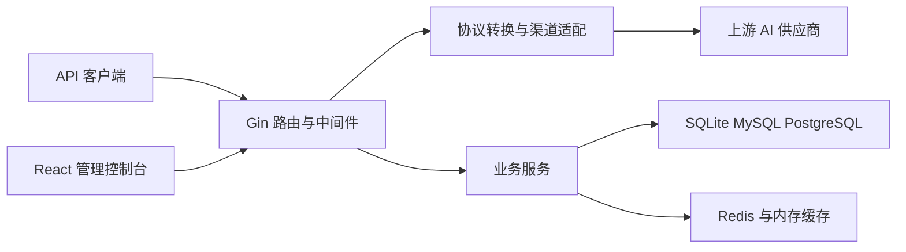

# AI README - 项目规则入口

<project_overview>

## 项目总览

new-api 是 Go 与 React 构建的全栈 AI API 网关，统一接入多种模型供应商，并提供认证、渠道调度、计费、限流、异步任务和管理控制台。

**核心能力**：兼容多种 AI 协议的请求转发、渠道选择、配额计费、用户与权限管理、运营配置及可视化管理。
</project_overview>

<generation_info>

## 生成信息

- **生成分支**: main
- **生成 Commit**: ccd535ef8e50cf6e5846a59278c40b7ff59d1b7d
- **生成时间**: 2026-08-12 16:58:31
</generation_info>

<quick_navigation>

## 快速导航

### 用户偏好备忘

- [S] [备忘](./备忘.mdc) - 用户偏好与关键确认点；每次执行 ai-readme 前必读

### AI 生成文档

- [x] 2026-08-12 16:06:08 [项目结构](./generated/项目结构.mdc) - 目录树、模块划分、依赖关系
- [x] 2026-08-12 16:06:08 [技术架构](./generated/技术架构.mdc) - 分层架构、技术栈与设计约束
- [x] 2026-08-12 16:06:08 [开发指南](./generated/开发指南.mdc) - 环境、命令、配置与开发约定
- [x] 2026-08-12 16:42:06 [核心流程](./generated/核心流程.mdc) - 启动、认证、转发与计费调用链
- [x] 2026-08-12 16:44:18 [数据层](./generated/数据层.mdc) - 数据库、实体、迁移与缓存
- [x] 2026-08-12 16:46:12 [状态管理](./generated/状态管理.mdc) - 前端客户端状态与服务端状态
- [x] 2026-08-12 16:49:21 [API接口](./generated/API接口.mdc) - 路由分组、协议入口与权限边界
- [x] 2026-08-12 16:52:07 [组件接口](./generated/组件接口.mdc) - 前端组件、功能模块与公共接口
- [x] 2026-08-12 16:55:03 [测试框架](./generated/测试框架.mdc) - Go 与前端测试工具和验证命令

### 人工维护文档

- [x] 2026-08-12 16:57:10 [业务知识](./manual/业务知识.mdc) - 项目背景、领域术语和业务规则
- [x] 2026-08-12 16:57:10 [边界定义](./manual/边界定义.mdc) - 模块职责与协作边界
- [x] 2026-08-12 16:57:10 [团队标准](./manual/团队标准.mdc) - Git、质量门禁和 Review 约定
- [x] 2026-08-12 16:57:10 [历史经验](./manual/历史经验.mdc) - 问题、原因、方案和预防措施

### 已有项目规则

- [S] [根目录项目约定](../../AGENTS.md) - 后端、数据库、计费安全、i18n 与项目治理规则
- [S] [前端开发规范](../../web/AGENTS.md) - React、TypeScript、测试、样式和可访问性规则

</quick_navigation>
