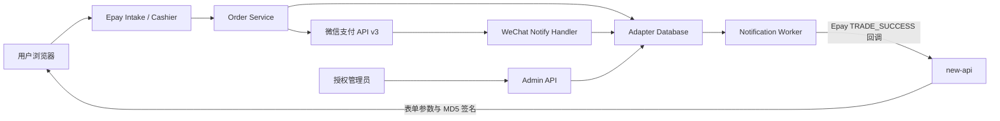
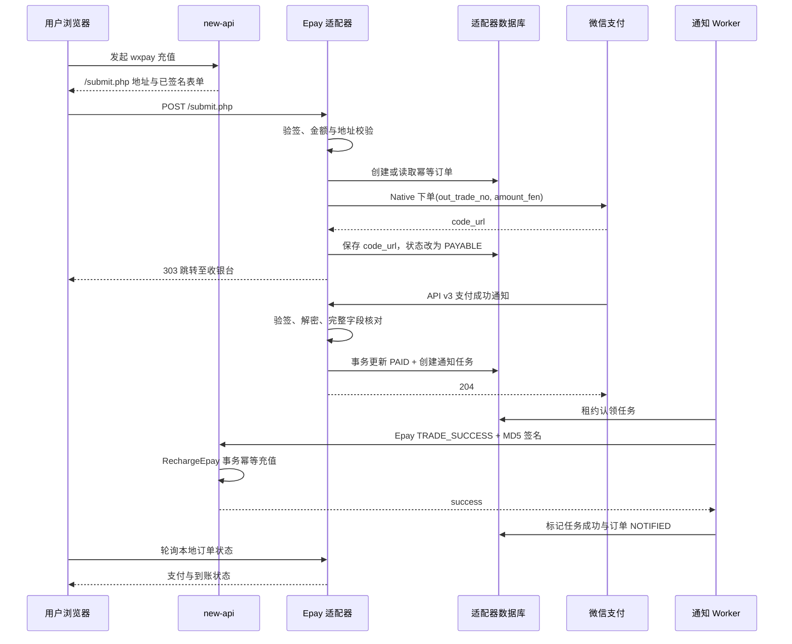
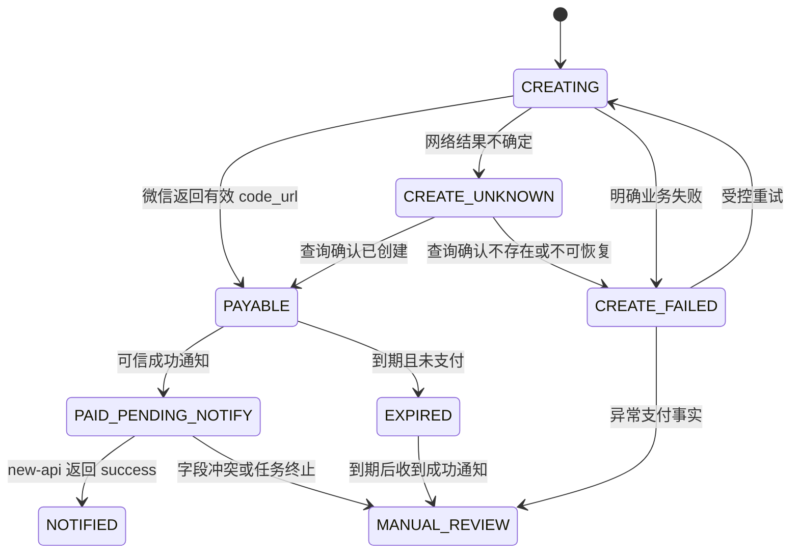
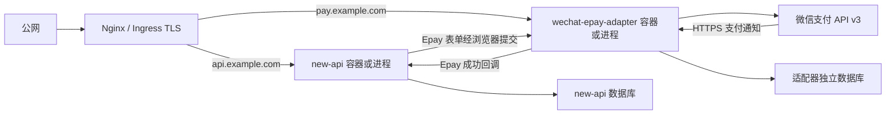

# 微信支付 Epay 适配器详细设计文档

## 0. 设计评审摘要（必读，约 2 页）

> 本节供产品、测试和研发快速评审；接口签名、表结构、时序与实现细节见 `## 1` 及之后。
> 可测需求以 PRD 与 `specs/*.md` 为准，本文件只描述实现方案。

### 0.1 一句话方案

新增一个独立部署、独立数据库的 Go 支付适配器，对 new-api 暴露现有 Epay `/submit.php` 表单协议，对微信支付使用 API v3 Native 下单和异步通知，并通过“支付订单 + 持久化通知任务”事务把可信支付结果最终、幂等地回调给 new-api。

### 0.2 做什么 / 不做什么（设计边界）

- **涉及**：独立 `wechat-epay-adapter` 服务、Epay 下单入口、扫码收银台、微信 API v3 Native 客户端、微信通知入口、三张业务表、后台通知 Worker、管理查询与人工重试、健康检查、指标和审计。
- **new-api 侧契约**：继续使用 `PayAddress`、`EpayId`、`EpayKey` 和 `wxpay` 支付方式；适配器回调现有 `/api/user/epay/notify`，不修改 new-api 源码、数据库或前端。
- **首期部署**：单个 new-api 站点、单个微信支付普通商户号；适配器可多实例运行，但共享同一业务数据库。
- **不做**：订阅购买验收、JSAPI/H5/小程序支付、多商户、服务商模式、自动退款、分账、提现、完整运营后台以及通过浏览器同步返回完成到账。

### 0.3 关键链路或架构决策

- new-api 仍按现有 `go-epay` 契约把浏览器表单提交到适配器 `POST /submit.php`；适配器校验 MD5 签名、固定商户号、`wxpay`、金额和目标地址。
- 金额进入服务后立即按十进制解析为人民币分，数据库、微信请求和回调核对均以 `amount_fen` 为真值，禁止使用浮点数参与支付计算。
- `out_trade_no` 是全链路业务幂等键。唯一约束解决并发重复下单；同单同参返回既有收银台，同单异参拒绝并审计。
- 微信下单使用官方 `wechatpay-go` SDK 与 `POST /v3/pay/transactions/native`；本地只在得到有效 `code_url` 后进入 `PAYABLE`。
- 收银台通过随机访问令牌定位订单，数据库只保存令牌摘要；页面轮询只读取本地状态，不能写入支付状态。
- 微信通知必须先完成平台签名验证和 AES-256-GCM 解密，再核对 `mchid`、`appid`、订单号、币种、金额和交易状态。
- “订单标记已支付”和“创建 new-api 通知任务”在一个数据库事务中完成。唯一 `order_id` 通知任务和状态条件更新共同防止重复到账。
- new-api 回调参数固定为 Epay 成功字段，并用共享 `EpayKey` 重新签名；只有 HTTP 2xx 且响应正文去空白后严格等于 `success` 才算通知成功。
- Worker 使用数据库租约和条件更新认领任务，不依赖内存队列；进程重启和多实例竞争不会丢任务或并发发送同一租约任务。
- 请求中的 `notify_url` 和 `return_url` 不直接作为任意网络目标。通知地址必须精确匹配配置；返回地址必须匹配允许的 HTTPS Origin 与路径前缀。

### 0.4 风险、降级与回滚

- **伪造或错单**：签名、解密或业务字段任一不一致即 fail-closed；可关联订单进入 `MANUAL_REVIEW`，不通知 new-api。
- **微信下单不确定**：超时不立即创建第二笔微信订单；订单进入 `CREATE_UNKNOWN`，由同一 `out_trade_no` 查询确认后再决定恢复或失败。
- **new-api 不可用**：已支付事实持久化，通知任务退避重试；超过自动重试窗口进入 `DEAD` 并告警，管理员可复用原任务重试。
- **适配器不可用**：new-api 的微信支付入口暂时无法拉起，但已支付订单数据不丢失；恢复后 Worker 继续通知。
- **密钥或数据库异常**：就绪检查失败并停止接收新订单；存活检查仍保持可用，便于编排系统判断进程状态。
- **回滚**：从 new-api 支付方式配置中移除 `wxpay` 或切换 `PayAddress`，停止适配器下单入口；保留微信通知、通知补偿、只读查询和审计，直至所有已支付订单完成到账核对。

### 0.5 测试与验收关注点

- Epay 合法签名、字段篡改、空字段、错误商户号、非 `wxpay`、金额上下界和地址白名单。
- `0.01`、`0.10`、`1.01` 的精确分转换；三位小数、指数形式、正负号、空白和超上限输入拒绝。
- 同一订单串行和并发提交、同单异参冲突、微信下单超时后恢复。
- 微信通知签名、证书/公钥标识、时间戳、随机串、解密、商户、AppID、币种、金额和交易状态校验。
- 同一成功通知并发 10 次，最终只有一次支付迁移、一个通知任务和一次 new-api 充值。
- 数据库事务提交前故障回滚、提交后进程退出恢复、Worker 租约过期接管、new-api 各类失败响应重试。
- 未授权管理请求、收银台令牌猜测、开放跳转、SSRF、日志脱敏、密钥轮换和备份恢复。
- 真实小额灰度至少 20 笔，逐笔核对适配器订单、微信交易号、new-api `TopUp.trade_no` 和到账额度。

---

## 1. 引言

### 1.1 背景

new-api 已通过 `controller.RequestEpay` 生成 Epay `/submit.php` 表单参数，并由 `controller.EpayNotify` 验签后调用 `model.RechargeEpay` 完成事务内幂等充值。现有缺口是一个能接收该 Epay 契约、调用微信支付 API v3 Native、验证微信通知并可靠回调 new-api 的独立网关。

### 1.2 设计目标

- 在不修改 new-api 代码的前提下完成余额充值闭环。
- 以服务端微信异步通知作为唯一支付事实来源。
- 通过数据库事务、唯一约束和状态条件更新保证跨进程幂等。
- 支持失败恢复、人工补偿、审计、指标和最小权限部署。
- 业务数据层同时兼容 SQLite、MySQL 5.7.8+ 和 PostgreSQL 9.6+。

### 1.3 已核对的现有契约

- new-api 下单字段为 `pid`、`type`、`out_trade_no`、`notify_url`、`return_url`、`name`、`money`、`device`、`sign_type`、`sign`，提交路径为 `/submit.php`。
- new-api 回调识别 `type`、`trade_no`、`out_trade_no`、`name`、`money`、`trade_status`，成功状态为 `TRADE_SUCCESS`。
- Epay MD5 签名与当前 `github.com/Calcium-Ion/go-epay/epay` 的字段过滤和排序规则保持完全一致。
- 微信侧采用 API v3 Native 支付和官方 `github.com/wechatpay-apiv3/wechatpay-go` SDK；实现阶段锁定已验证版本并通过沙箱/真实小额联调确认契约。

## 2. 系统架构

### 2.1 部署与依赖

适配器代码放在当前仓库根目录的独立文件夹 `wechat-epay-adapter/`，完整路径为 `E:\code\new-api\wechat-epay-adapter\`。该目录拥有自己的 `go.mod`、启动入口、配置、数据库模型、迁移、测试和 Dockerfile。

适配器不是 new-api 主程序中的 Controller、Service 或 Model，也不编译进 new-api 二进制。它作为独立 Go module、独立容器和独立进程交付，不导入 new-api 根模块包，不访问 new-api 的进程内对象，也不直接读写 new-api 数据库。两者只通过现有 Epay HTTP 协议通信。

采用“同一 Git 仓库、独立顶层目录、独立构建发布”的组织方式，原因如下：

- 便于一次提交同时评审 Epay 契约与适配器实现。
- 不需要额外维护第二个 Git 仓库和权限体系。
- `wechat-epay-adapter/go.mod` 能从编译层面阻止误用 new-api 内部包。
- new-api 和适配器仍可独立构建、独立升级、独立回滚和独立扩缩容。

静态收银台资源嵌入适配器二进制；数据库为唯一业务真值，Redis 不作为首期必需依赖。



### 2.2 核心支付时序



### 2.3 模块划分

| 模块 | 职责 | 主要边界 |
| --- | --- | --- |
| `cmd/server` | 配置加载、依赖装配、HTTP Server、优雅退出 | 不包含支付规则 |
| `internal/http/epay` | `/submit.php` 表单绑定、错误映射、收银台跳转 | 不直接写数据库 |
| `internal/epay` | MD5 验签与回调签名、字段规范化 | 与 new-api 的 go-epay 契约一致 |
| `internal/order` | 下单幂等、金额转换、状态机、收银台查询 | 支付领域主服务 |
| `internal/wechat` | Native 下单、订单查询、通知验签解密 | 封装官方 SDK，不泄漏 SDK DTO 到领域层 |
| `internal/settlement` | 微信支付事实核对、事务结算、通知任务创建 | 不直接调用 new-api |
| `internal/delivery` | 通知任务租约、Epay 回调、退避与人工重试 | 只使用持久化任务 |
| `internal/store` | GORM 模型、迁移、事务和条件更新 | 三数据库兼容 |
| `internal/admin` | 订单查询、人工重试、审计 | Bearer 管理认证 |
| `internal/observability` | 请求 ID、结构化日志、指标、健康检查 | 全链路脱敏 |

### 2.4 状态机



- 所有状态迁移使用“当前状态 + 版本号”的条件更新；不允许无条件覆盖终态。
- `PAID_PENDING_NOTIFY` 与 `NOTIFIED` 都表示微信侧已支付，区别仅是 new-api 是否确认到账。
- `MANUAL_REVIEW` 禁止自动通知；管理员核对后只能恢复原通知任务或维持冻结，不能生成第二个业务订单。

### 2.5 代码目录规划

```text
new-api/
├── controller/                    # 现有 new-api 代码，不修改
├── model/                         # 现有 new-api 代码，不修改
├── service/                       # 现有 new-api 代码，不修改
├── web/                           # 现有 new-api 前端，不修改
└── wechat-epay-adapter/           # 新增的独立支付适配器
    ├── cmd/
    │   └── server/
    │       └── main.go            # 适配器唯一启动入口
    ├── internal/
    │   ├── admin/                 # 管理查询与人工补偿
    │   ├── config/                # 环境变量加载与启动校验
    │   ├── delivery/              # new-api 通知 Worker
    │   ├── epay/                  # Epay 验签与回调签名
    │   ├── httpserver/            # 路由、中间件、收银台静态资源
    │   ├── observability/         # 日志、指标与健康检查
    │   ├── order/                 # 订单状态机与业务服务
    │   ├── settlement/            # 微信通知核对与结算事务
    │   ├── store/                 # GORM 模型、迁移与事务
    │   └── wechat/                # 微信支付官方 SDK 封装
    ├── migrations/                # 三数据库兼容迁移
    ├── web/                       # 收银台源码和模板
    ├── deploy/
    │   ├── docker-compose.yml     # 适配器独立部署示例
    │   ├── nginx.conf.example     # 域名与 TLS 反向代理示例
    │   └── systemd.service        # 二进制部署示例
    ├── .env.example               # 非敏感配置模板
    ├── Dockerfile                 # 独立镜像构建
    ├── go.mod                     # 独立 Go module
    ├── go.sum
    └── README.md                  # 配置、部署、轮换和排障说明
```

目录边界要求：

- `wechat-epay-adapter/` 不得导入 `github.com/QuantumNous/new-api/...`。
- 适配器独立执行 `GOWORK=off go build ./...` 和 `GOWORK=off go test ./...`。
- 根目录执行 new-api 构建时不应隐式构建或启动适配器。
- 适配器镜像、版本号、发布产物和数据库迁移与 new-api 分开管理。

## 3. 接口设计

### 3.1 接口列表

| 接口名称 | 方法 | URL | 认证 | 描述 |
| --- | --- | --- | --- | --- |
| Epay 下单 | POST | `/submit.php` | Epay MD5 | 接收 new-api 表单并跳转收银台 |
| 收银台页面 | GET | `/cashier/{access_token}` | 不可猜测令牌 | 展示二维码与本地状态 |
| 收银台状态 | GET | `/api/v1/cashier/{access_token}/status` | 不可猜测令牌 | 只读轮询订单状态 |
| 微信通知 | POST | `/api/v1/wechat/notify` | 微信 API v3 签名 | 接收、验证并结算支付 |
| 存活检查 | GET | `/health/live` | 无 | 进程存活 |
| 就绪检查 | GET | `/health/ready` | 无 | 数据库、配置和密钥就绪 |
| 指标 | GET | `/metrics` | 内网或独立令牌 | Prometheus 指标 |
| 管理查询 | GET | `/api/v1/admin/orders/{out_trade_no}` | Admin Bearer | 查询订单及通知状态 |
| 人工重试 | POST | `/api/v1/admin/orders/{out_trade_no}/retry-notification` | Admin Bearer | 复用原通知任务 |

### 3.2 `POST /submit.php`

**Content-Type**：`application/x-www-form-urlencoded`

| 字段 | 类型 | 必填 | 约束 |
| --- | --- | --- | --- |
| `pid` | string | 是 | 与 `EPAY_PARTNER_ID` 精确一致 |
| `type` | string | 是 | 首期仅 `wxpay` |
| `out_trade_no` | string | 是 | 1-255 字节；仅允许配置字符集；全局唯一 |
| `notify_url` | string | 是 | 规范化后与配置地址精确一致 |
| `return_url` | string | 是 | HTTPS 且命中允许 Origin 与路径前缀 |
| `name` | string | 是 | 1-128 字节；展示前 HTML 转义 |
| `money` | string | 是 | 普通十进制、最多两位小数、范围 `0.01..MAX_ORDER_AMOUNT_YUAN` |
| `device` | string | 否 | `pc` 或 `mobile`；未知值不影响支付协议 |
| `sign_type` | string | 是 | `MD5` |
| `sign` | string | 是 | 32 位十六进制，常量时间比较 |

**成功响应**：`303 See Other`，`Location: /cashier/{access_token}`。

**重复请求**：关键字段摘要一致时返回原收银台；摘要不一致时返回 `409 Conflict`。

**错误响应**：浏览器可读的最小 HTML 错误页，不回显签名、密钥、完整地址或内部错误。

| 场景 | HTTP 状态 |
| --- | --- |
| 表单缺失、金额或 URL 格式错误 | `400` |
| 商户号、支付类型、签名类型或签名错误 | `403` |
| 同订单号业务字段冲突 | `409` |
| 服务未就绪 | `503` |
| 微信明确拒绝或内部不可恢复错误 | `502` |

### 3.3 `GET /api/v1/cashier/{access_token}/status`

**Response**：

```json
{
  "out_trade_no": "USR1NO...",
  "subject": "TUC100",
  "amount": "1.00",
  "status": "PAYABLE",
  "expires_at": "RFC3339",
  "paid_at": null,
  "notified_at": null,
  "redirect_allowed": true,
  "return_url": null
}
```

- `return_url` 仅在订单已支付且地址仍通过当前白名单复核时返回。
- 不返回 `code_url`、商户号、微信交易号、通知失败详情或内部状态原因。
- 响应头使用 `Cache-Control: no-store`；令牌错误统一返回 `404`。

### 3.4 `POST /api/v1/wechat/notify`

- 原始请求体和微信签名 Header 交给官方 SDK 验签与解密。
- 仅接受允许的时间偏差；平台证书或微信支付公钥按序列号/公钥 ID 选择。
- 成功持久化后返回 `204 No Content`；格式或签名非法返回 `400`；数据库临时失败返回 `500` 以触发微信重试。
- 对未知订单返回 `200` 并记录高优先级审计，避免无意义重放；不产生到账任务。

### 3.5 new-api Epay 成功回调

**目标**：订单创建时已验证并保存的固定 `notify_url`，实际发送前再次与配置精确比对。

**方法**：`POST application/x-www-form-urlencoded`

| 字段 | 来源 |
| --- | --- |
| `pid` | `EPAY_PARTNER_ID` |
| `type` | 固定 `wxpay` |
| `out_trade_no` | 本地订单业务号 |
| `trade_no` | 适配器生成的稳定网关订单号 |
| `name` | 本地订单快照 |
| `money` | 由 `amount_fen` 格式化为两位小数 |
| `trade_status` | 固定 `TRADE_SUCCESS` |
| `sign_type` | 固定 `MD5` |
| `sign` | 按 go-epay 规则使用 `EPAY_KEY` 计算 |

- 单次请求超时：连接 3 秒，总超时 10 秒；禁止自动跟随跨 Origin 重定向。
- 成功条件：HTTP 2xx 且正文去除首尾空白后严格等于 `success`。
- 所有重试复用同一字段快照、`trade_no` 和签名输入。

### 3.6 管理接口

`GET /api/v1/admin/orders/{out_trade_no}` 返回：订单状态、金额、创建/支付/到账时间、脱敏微信交易号、通知状态、尝试次数、下次执行时间和最近脱敏错误。

`POST /api/v1/admin/orders/{out_trade_no}/retry-notification`：

```json
{
  "reason": "人工核对后重试"
}
```

- 仅允许微信已支付且通知未成功的订单。
- 将原任务从 `RETRY` 或 `DEAD` 恢复为 `PENDING`，清除租约并把 `next_attempt_at` 设置为当前时间。
- 返回 `202 Accepted`；订单未支付返回 `409`，已通知成功返回 `200` 且不重复投递。

## 4. 数据模型

### 4.1 `payment_orders`

| 字段 | 逻辑类型 | 约束/索引 | 说明 |
| --- | --- | --- | --- |
| `id` | string(36) | PK | 应用生成 UUID |
| `out_trade_no` | string(255) | UNIQUE NOT NULL | new-api 业务订单号 |
| `gateway_trade_no` | string(64) | UNIQUE NOT NULL | Epay 回调 `trade_no` |
| `request_fingerprint` | string(64) | NOT NULL | 关键请求字段摘要 |
| `epay_pid` | string(64) | NOT NULL | 商户号快照 |
| `payment_type` | string(16) | NOT NULL | 首期 `wxpay` |
| `subject` | string(128) | NOT NULL | 商品名快照 |
| `amount_text` | string(32) | NOT NULL | 规范化两位小数文本 |
| `amount_fen` | int64 | NOT NULL | 支付金额真值，必须大于 0 |
| `notify_url` | string(2048) | NOT NULL | 已通过精确白名单的回调地址 |
| `return_url` | string(2048) | NULL | 已通过白名单的浏览器地址 |
| `cashier_token_hash` | string(64) | UNIQUE NOT NULL | 收银台访问令牌 SHA-256 |
| `status` | string(32) | INDEX NOT NULL | 支付状态机 |
| `wechat_code_url` | text | NULL | 有效期内二维码内容，不写日志 |
| `wechat_transaction_id` | string(64) | UNIQUE NULL | 微信交易号 |
| `wechat_notification_id` | string(64) | UNIQUE NULL | 首个成功通知 ID |
| `wechat_payer_openid_hash` | string(64) | NULL | 可选核对信息，不保存明文 OpenID |
| `expires_at` | timestamp | INDEX NOT NULL | 支付有效期 |
| `paid_at` | timestamp | NULL | 微信成功时间 |
| `notified_at` | timestamp | NULL | new-api 确认时间 |
| `last_error_code` | string(64) | NULL | 脱敏错误码 |
| `last_error_message` | string(512) | NULL | 脱敏错误摘要 |
| `version` | int64 | NOT NULL | 乐观并发版本 |
| `created_at` / `updated_at` | timestamp | INDEX | 审计时间 |

索引 `status, expires_at` 支持过期扫描；`status, updated_at` 支持异常订单查询。SQLite、MySQL 和 PostgreSQL 均使用普通字符串状态，不依赖数据库 ENUM。

### 4.2 `notification_tasks`

| 字段 | 逻辑类型 | 约束/索引 | 说明 |
| --- | --- | --- | --- |
| `id` | string(36) | PK | 任务 ID |
| `order_id` | string(36) | UNIQUE NOT NULL | 每个订单最多一个有效任务 |
| `state` | string(16) | INDEX NOT NULL | `PENDING/PROCESSING/RETRY/SUCCEEDED/DEAD` |
| `payload_snapshot` | text | NOT NULL | 固定业务字段 JSON，不含共享密钥 |
| `attempt_count` | int | NOT NULL | 投递次数 |
| `next_attempt_at` | timestamp | INDEX NOT NULL | 下次执行时间 |
| `lease_owner` | string(64) | NULL | Worker 实例 ID |
| `lease_until` | timestamp | INDEX NULL | 任务租约到期时间 |
| `last_http_status` | int | NULL | 下游状态码 |
| `last_error` | string(512) | NULL | 脱敏错误 |
| `completed_at` | timestamp | NULL | 成功时间 |
| `version` | int64 | NOT NULL | 条件更新版本 |
| `created_at` / `updated_at` | timestamp |  | 审计时间 |

索引 `state, next_attempt_at` 支持到期任务扫描；`state, lease_until` 支持崩溃任务接管。

### 4.3 `payment_audit_events`

| 字段 | 逻辑类型 | 约束/索引 | 说明 |
| --- | --- | --- | --- |
| `id` | string(36) | PK | 事件 ID |
| `order_id` | string(36) | INDEX NULL | 可关联订单 |
| `event_type` | string(64) | INDEX NOT NULL | 下单、冲突、支付、重试、审查等 |
| `actor_type` | string(16) | NOT NULL | `SYSTEM/WECHAT/ADMIN` |
| `actor_id` | string(128) | NULL | 脱敏管理员或实例标识 |
| `request_id` | string(64) | INDEX NULL | 链路请求 ID |
| `result` | string(16) | NOT NULL | `SUCCESS/REJECTED/FAILED` |
| `metadata` | text | NULL | 脱敏结构化 JSON |
| `created_at` | timestamp | INDEX NOT NULL | 事件时间 |

### 4.4 事务边界

1. **微信支付确认事务**：锁定/条件读取订单，核对允许状态，写入微信交易信息和 `PAID_PENDING_NOTIFY`，创建唯一通知任务，追加审计事件；任一步失败全部回滚。
2. **通知成功事务**：条件更新任务 `PROCESSING -> SUCCEEDED`，同时更新订单 `PAID_PENDING_NOTIFY -> NOTIFIED` 和 `notified_at`，追加审计事件。
3. **人工重试事务**：校验订单已支付，条件恢复原任务、清理租约并追加管理员审计事件。
4. 常规行锁通过适配器自己的跨方言 `lockForUpdate` 封装：MySQL/PostgreSQL 使用 `FOR UPDATE`，SQLite 依赖写事务和条件更新；不使用数据库专属 `SKIP LOCKED`。

## 5. 核心业务逻辑

### 5.1 Epay 请求校验与幂等创建

1. 限制表单体大小、字段数和单字段长度，拒绝重复关键字段。
2. 使用原始字符串按 go-epay 规则完成 MD5 验签，再做业务规范化，避免验签前改写字段。
3. `money` 只接受普通十进制表示，转换为分后校验最小值和配置上限；禁止科学计数法和浮点解析。
4. `notify_url` 必须与 `NEW_API_NOTIFY_URL` 规范化后精确相等；`return_url` 仅允许配置的 HTTPS Origin、端口和路径前缀。
5. 对商户号、支付类型、订单号、金额分、商品名、通知地址和返回地址生成请求摘要。
6. 按 `out_trade_no` 创建订单。唯一冲突时读取原订单：摘要一致返回原结果，摘要不同返回冲突并写安全审计。
7. 首个创建者调用微信 Native 下单；其他并发请求只等待/读取该订单状态，不重复创建微信订单。

### 5.2 微信 Native 下单

- 请求字段：`appid`、`mchid`、`description`、`out_trade_no`、`notify_url`、`time_expire`、`amount.total` 和 `amount.currency=CNY`。
- 微信 `out_trade_no` 直接使用 new-api 的 `out_trade_no`，便于全链路核对；长度或字符集不满足微信限制时在 Epay 入口直接拒绝。
- 明确业务失败写入 `CREATE_FAILED`；网络超时、连接中断或响应不可判定写入 `CREATE_UNKNOWN`。
- `CREATE_UNKNOWN` 只允许通过微信商户订单号查询恢复，禁止直接再次下单；查询确认不存在后方可受控重试。
- `code_url` 仅保存于订单表并在收银台服务端生成二维码，不出现在访问日志、指标标签或管理列表。

### 5.3 微信通知验证与结算

1. 先验证 HTTP 消息签名和时间窗口，再解密资源；失败不读取或更新订单业务状态。
2. 从解密结果定位 `out_trade_no`，读取本地订单。
3. 核对 `trade_state=SUCCESS`、`mchid`、`appid`、`out_trade_no`、`amount.currency=CNY`、`amount.total=amount_fen`。
4. `PAYABLE` 或 `CREATE_UNKNOWN` 的匹配成功订单可进入支付确认事务。
5. 已处于 `PAID_PENDING_NOTIFY` 或 `NOTIFIED` 且微信交易号一致时作为幂等成功；交易号不一致进入人工审查。
6. `EXPIRED`、`CREATE_FAILED` 或 `CLOSED` 收到成功通知时进入 `MANUAL_REVIEW`，保留支付事实但不自动通知。
7. 字段不匹配时记录期望值和实际值的非敏感摘要，状态改为 `MANUAL_REVIEW`，不得创建通知任务。

### 5.4 通知调度、租约与退避

- Worker 每秒扫描少量到期的 `PENDING/RETRY` 或租约已过期的 `PROCESSING` 任务。
- 认领使用条件更新：状态、`next_attempt_at`、租约条件和版本同时匹配才成功；认领后设置实例 ID 和短租约。
- 自动重试建议间隔：5 秒、30 秒、2 分钟、10 分钟、30 分钟、2 小时、6 小时，之后每 6 小时一次，最长 72 小时或 20 次。
- HTTP 连接错误、超时、5xx、429、非 `success` 正文均进入 `RETRY`；永久性配置错误立即进入 `DEAD` 并告警。
- `DEAD` 不再自动投递，但任务和字段快照永久保留，管理员核对后可恢复原任务。
- 即使租约到期导致极少量重复 HTTP 投递，new-api 的 `RechargeEpay` 事务幂等与适配器稳定签名共同保证最多到账一次。

### 5.5 收银台

- 页面展示商品名、两位小数金额、服务端生成的二维码、到期倒计时和本地状态。
- 前端以固定最小间隔轮询状态，页面隐藏后降低频率；查询失败保留已有信息并允许恢复。
- `PAYABLE` 才展示二维码；`EXPIRED/CREATE_FAILED/MANUAL_REVIEW` 停止支付引导。
- `PAID_PENDING_NOTIFY` 展示“支付成功，到账处理中”；`NOTIFIED` 展示“充值已确认”。
- 自动跳转只发生在 `NOTIFIED` 且服务端返回仍通过白名单的 `return_url` 后；缺失地址则停留结果页。

### 5.6 过期与恢复任务

- 周期任务把超过 `expires_at` 且仍为 `PAYABLE` 的订单条件更新为 `EXPIRED`。
- 启动时不做内存状态恢复；Worker 直接从数据库扫描未完成通知和过期租约。
- 对 `CREATE_UNKNOWN` 执行有限次数微信订单查询，超过观察窗口进入 `MANUAL_REVIEW`，避免错误重建订单。
- 备份必须同时覆盖三张表；恢复后先以只读模式核对订单与任务关系，再开启 Worker 和新下单流量。

## 6. 安全设计

### 6.1 密钥与配置

- 商户 API 私钥、API v3 Key、Epay Key、管理令牌只从环境变量或挂载 Secret 读取，不写数据库、镜像层和日志。
- 私钥文件使用只读挂载和最小文件权限；进程使用非 root 用户。
- 微信验签支持平台证书模式或微信支付公钥模式，按材料标识路由；轮换窗口允许新旧有效材料并存。
- 启动时校验商户号、AppID、密钥长度、私钥可解析性和通知公网地址；缺失时 readiness 失败。

### 6.2 URL 与网络安全

- Epay 请求中的通知地址必须精确等于配置值，不基于请求地址动态放行。
- 返回地址使用解析后的 scheme、hostname、规范端口和 clean path 比较，禁止 userinfo、非 HTTPS、环回、私网、链路本地和非允许端口。
- new-api HTTP Client 禁止代理继承或仅使用显式可信代理；DNS 解析结果需拒绝私网地址，重定向后再次校验目标。
- 数据库和管理接口不暴露公网；公网仅开放 `/submit.php`、收银台、状态接口和微信通知。

### 6.3 认证与数据保护

- 管理 API 使用高熵 Bearer Token 常量时间比较，并可叠加反向代理 IP 白名单或 mTLS。
- 收银台令牌至少 128 位随机熵，数据库仅保存摘要；令牌不进入日志和指标。
- 日志禁止输出 Epay Key、API v3 Key、私钥、完整签名、`code_url`、完整 OpenID、完整访问令牌和完整回调表单。
- 审计元数据只保存字段名、错误类别、金额和标识符的脱敏形式。

## 7. 可观测性与运维

### 7.1 指标

| 指标 | 类型 | 标签限制 |
| --- | --- | --- |
| `payment_orders_total` | Counter | `result`, `reason` |
| `wechat_native_requests_total` | Counter | `result`, `wechat_code` |
| `wechat_notifications_total` | Counter | `result`, `reason` |
| `payment_order_state` | Gauge | `state` |
| `notification_tasks_pending` | Gauge | `state` |
| `notification_attempts_total` | Counter | `result` |
| `payment_to_notify_seconds` | Histogram | 无订单号标签 |
| `http_request_duration_seconds` | Histogram | `route`, `method`, `status` |

订单号、交易号、URL、用户标识不得作为指标标签。通知积压、连续失败、`MANUAL_REVIEW` 增长、readiness 失败和证书临近过期需要告警。

### 7.2 健康检查

- `/health/live` 只验证进程事件循环可响应，不探测微信或 new-api。
- `/health/ready` 验证数据库读写探针、必需配置和密钥已加载；不因 new-api 或微信短暂不可用而反复摘除实例。
- Worker 状态通过指标和管理查询观测，不与存活检查耦合。

### 7.3 审计事件

至少记录：订单创建、重复下单、冲突拒绝、微信下单失败、成功通知、通知校验失败、字段不匹配、状态进入人工审查、通知重试、任务终止、人工恢复和配置就绪失败。

## 8. 配置设计

| 配置键 | 必填 | 说明 |
| --- | --- | --- |
| `DATABASE_DSN` / `DATABASE_TYPE` | 是 | SQLite、MySQL 或 PostgreSQL |
| `PUBLIC_BASE_URL` | 是 | 适配器公网 HTTPS 根地址 |
| `EPAY_PARTNER_ID` | 是 | 与 new-api `EpayId` 一致 |
| `EPAY_KEY` | 是 | 与 new-api `EpayKey` 一致 |
| `NEW_API_NOTIFY_URL` | 是 | 精确的 `/api/user/epay/notify` 地址 |
| `RETURN_URL_ALLOWLIST` | 是 | 允许的 HTTPS Origin 与路径前缀 |
| `MAX_ORDER_AMOUNT_YUAN` | 是 | 单笔金额上限 |
| `WECHAT_APP_ID` | 是 | 微信 AppID |
| `WECHAT_MCH_ID` | 是 | 普通商户号 |
| `WECHAT_MCH_CERT_SERIAL` | 是 | 商户证书序列号 |
| `WECHAT_MCH_PRIVATE_KEY_FILE` | 是 | 商户 API 私钥挂载路径 |
| `WECHAT_API_V3_KEY` | 是 | 通知资源解密密钥 |
| `WECHAT_NOTIFY_URL` | 是 | 适配器微信通知公网地址 |
| `WECHAT_VERIFY_MODE` | 是 | 固定为 `public_key` |
| `WECHAT_PUBLIC_KEY_ID` | 是 | 微信支付公钥 ID，用于按材料标识验签 |
| `WECHAT_PUBLIC_KEY_FILE` | 是 | 微信支付公钥 PEM 文件挂载路径 |
| `ADMIN_API_TOKEN` | 是 | 管理接口高熵令牌 |
| `NOTIFICATION_WORKERS` | 否 | 有界 Worker 数，默认小并发 |
| `LOG_LEVEL` | 否 | 生产默认 `info` |

配置只在启动时加载。密钥轮换通过双材料配置和滚动重启完成，不实现运行时远程配置刷新。

### 8.1 上线拓扑

生产环境至少运行两个独立服务：



- new-api 与适配器使用不同域名或至少不同路由前缀，生产环境统一由反向代理终止 TLS。
- 适配器使用独立数据库或独立 schema 和独立数据库账号，不复用 new-api 业务表。
- SQLite 只适合本地开发或单实例试运行；生产环境推荐 MySQL 或 PostgreSQL，以支持多实例、备份和可靠锁竞争。
- 微信商户平台的 Native 支付通知地址配置为 `https://pay.example.com/api/v1/wechat/notify`。
- new-api 的 `PayAddress` 配置为 `https://pay.example.com`，`EpayId/EpayKey` 与适配器的 `EPAY_PARTNER_ID/EPAY_KEY` 保持一致，支付方式包含 `wxpay`。

### 8.2 Docker 启动方式（生产推荐）

适配器单独构建镜像，不加入 new-api 镜像：

```bash
docker build -t wechat-epay-adapter:1.0.0 ./wechat-epay-adapter
```

容器启动示例：

```bash
docker run -d \
  --name wechat-epay-adapter \
  --restart unless-stopped \
  --env-file /etc/wechat-epay-adapter/adapter.env \
  -v /etc/wechat-epay-adapter/secrets:/run/secrets:ro \
  -p 127.0.0.1:8081:8080 \
  wechat-epay-adapter:1.0.0
```

- `adapter.env` 只保存普通配置；商户私钥以只读文件挂载到 `/run/secrets`。
- 宿主机只监听 `127.0.0.1:8081`，公网访问由 Nginx/Ingress 转发。
- 容器启动后先检查 `/health/live` 和 `/health/ready`，readiness 成功后才接入支付流量。
- 数据库迁移在进程启动阶段以数据库租约串行执行；迁移失败则进程退出且不监听业务端口。

`wechat-epay-adapter/deploy/docker-compose.yml` 只管理适配器及其独立数据库连接。是否把该 Compose 文件与现有 new-api Compose 一起编排属于部署选择，不改变二者独立服务的边界。

### 8.3 二进制启动方式

构建：

```bash
cd wechat-epay-adapter
GOWORK=off go build -trimpath -o bin/wechat-epay-adapter ./cmd/server
```

启动：

```bash
set -a
. /etc/wechat-epay-adapter/adapter.env
set +a
./bin/wechat-epay-adapter
```

生产使用 `wechat-epay-adapter/deploy/systemd.service` 托管，要求：

- `Restart=on-failure`，设置合理的停止超时。
- 使用独立低权限系统用户。
- 私钥目录只允许该用户读取。
- `ExecStartPre` 执行配置检查，健康检查通过后再由反向代理放流。

### 8.4 本地开发启动方式

```bash
cd wechat-epay-adapter
copy .env.example .env
GOWORK=off go run ./cmd/server
```

本地可使用 SQLite 和微信测试配置；真实通知联调仍需要可被微信访问的 HTTPS 地址。开发环境不得复用生产商户私钥、API v3 Key 或 Epay Key。

### 8.5 上线顺序

1. 创建适配器独立数据库、账号、备份策略和 Secret。
2. 部署适配器，但暂不在 new-api 启用 `wxpay`。
3. 检查数据库迁移、`/health/ready`、TLS、微信通知地址和出站访问。
4. 用受控订单完成适配器与微信 API v3 联调。
5. 在 new-api 配置 `PayAddress`、`EpayId`、`EpayKey` 和 `wxpay`。
6. 灰度开放小额充值，完成至少 20 笔逐笔核对。
7. 放开正常金额上限并持续观察通知积压、人工审查和到账时延指标。

### 8.6 停止与回滚顺序

1. 先从 new-api 支付方式中移除 `wxpay`，阻止新订单进入。
2. 保持适配器的微信通知入口和 Worker 运行，处理已创建或已支付订单。
3. 确认没有 `PAID_PENDING_NOTIFY`、`PROCESSING` 或 `RETRY` 任务后，才停止适配器。
4. 回滚镜像时只切换适配器版本，不回滚或删除已确认支付数据。
5. 数据库迁移必须采用向前兼容策略；需要回退应用版本时，新旧版本应能在过渡期读取同一结构。

## 9. 测试设计

### 9.1 单元与协议测试

- Epay 签名生成/验证与当前 go-epay 固定向量双向兼容。
- 金额文本到分、分到两位小数文本的确定性表格测试。
- URL 规范化、白名单、重定向和 DNS 私网拒绝测试。
- 状态机允许/拒绝迁移、请求摘要稳定性和脱敏规则测试。
- 微信 SDK 边界使用官方示例签名和加密通知 fixture，不自行伪造协议语义。

### 9.2 数据库与并发测试

- SQLite fixture 验证唯一约束、事务回滚、任务租约和条件更新。
- MySQL/PostgreSQL CI 或集成环境验证迁移、行锁和时间字段兼容。
- 相同下单并发 10 次只产生一条订单；同一通知并发 10 次只产生一个任务。
- 在订单状态更新后、任务创建后和事务提交前注入错误，验证无半完成状态。

### 9.3 集成与故障测试

- 模拟微信下单成功、明确失败、超时、查询恢复和无效 `code_url`。
- 模拟 new-api 返回 `success`、带空白的 `success`、其他正文、3xx、4xx、5xx、超时和连接失败。
- 验证服务重启、Worker 崩溃、租约到期、多实例竞争和人工重试。
- 验证日志、数据库导出和容器镜像不含私钥、明文 Key 或可复用访问凭据。

### 9.4 上线验收

1. 预生产完成微信通知公网可达、证书/公钥轮换和回调签名联调。
2. 灰度阶段限制单笔金额并完成至少 20 笔真实小额支付。
3. 每笔核对金额分、微信交易号、适配器状态、new-api 订单状态和用户额度。
4. 人工制造 new-api 停机，验证恢复后自动到账且无重复充值。
5. 完成数据库备份恢复演练，RPO 不超过 15 分钟，单实例 RTO 不超过 1 小时。

## 10. 实施影响与任务边界

- 新代码统一新增在仓库根目录 `wechat-epay-adapter/`，不放入现有 `controller/`、`service/`、`model/`、`router/` 或 `web/`。
- new-api 代码、数据库和前端无修改；部署侧只把现有 Epay `PayAddress` 指向适配器，并配置相同 `EpayId/EpayKey` 与 `wxpay`。
- 适配器与 new-api 是两个独立进程、两个构建产物、两个容器和两个发布单元。停止或升级其中一个不要求重新编译另一个。
- 新适配器应独立构建、测试和发布；其 Go module 不依赖 new-api 根 module，避免版本升级耦合。
- 实现任务应按“工程骨架与配置、Epay 入口、微信下单与收银台、通知结算、可靠投递、管理运维、安全与测试、部署联调”拆分。
- 在进入实现前，需由研发确认微信验签采用平台证书还是微信支付公钥模式，并由运维提供对应生产 Secret 与公网域名。
