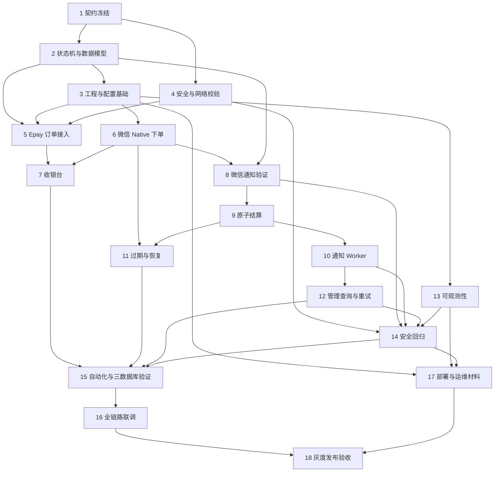

# 微信支付 Epay 适配器实施计划

## 任务说明

- ✅ 已存在任务：禅道中已存在并完成 ID 回填的任务。
- 🆕 新创建任务：同步禅道后新建并回填 ID 的任务。
- `(P)`：满足前置依赖后可与同阶段任务并行执行。
- 本计划仅新增独立模块 `wechat-epay-adapter/`，不修改 new-api 源码、数据库或前端。
- 已同步至禅道执行 `50`（`release_v1.0.0`），任务 ID 已回填。

## 契约与模型定义

- [x] 1. 冻结 Epay、微信支付与管理接口契约
  - 需求：45
  - 禅道任务ID：297
  - 预计工时：4小时
  - **接口/协议变更**：
    - `wechat-epay-adapter/internal/httpserver/`：定义 `/submit.php`、收银台状态、微信通知、健康检查、指标、管理查询与人工重试的路由、请求响应和错误码。
    - `wechat-epay-adapter/internal/epay/`：冻结与 go-epay 一致的 MD5 字段过滤、排序、签名和回调成功判定规则。
    - `wechat-epay-adapter/internal/wechat/`：定义 Native 下单、商户订单查询和通知解密后的领域接口，隔离官方 SDK DTO。
  - **配置变更**：
    - `wechat-epay-adapter/.env.example`：列出接口契约依赖的商户、地址、验签模式和金额上限配置键，不写入真实密钥。
  - 依赖：无；完成后作为所有编码任务的契约基线。
  - 验收标准：接口字段、HTTP 状态、成功条件、错误映射和 fail-closed 策略与设计一致；确认采用平台证书或微信支付公钥验签模式。
  - 测试覆盖率：≥80%（核心协议契约）
  - 参考：design.md § 3.1-3.6、§ 8

- [x] 2. 建立订单状态机与跨数据库持久化模型 (P)
  - 需求：45
  - 禅道任务ID：298
  - 预计工时：6小时
  - **后端代码变更**：
    - `wechat-epay-adapter/internal/order/`：定义订单状态、通知任务状态、允许迁移、版本条件和领域对象。
    - `wechat-epay-adapter/internal/store/`：实现 `payment_orders`、`notification_tasks`、`payment_audit_events` 的 GORM 模型、事务接口、唯一约束和跨方言锁封装。
  - **SQL执行**：
    - `wechat-epay-adapter/migrations/`：新增 SQLite、MySQL 5.7.8+、PostgreSQL 9.6+ 均可执行的初始化迁移和索引。
  - 依赖：任务 1 的字段与状态契约。
  - 验收标准：三张表约束和索引完整；非法终态覆盖被拒绝；SQLite 不生成不支持的锁或迁移语法。
  - 测试覆盖率：≥80%（核心数据与状态机）
  - 参考：design.md § 2.4、§ 4.1-4.4

## 工程与配置基础

- [x] 3. 搭建独立 Go 模块与服务启动装配
  - 需求：45
  - 禅道任务ID：299
  - 预计工时：4小时
  - **配置变更**：
    - `wechat-epay-adapter/go.mod`：建立独立 Go module，锁定 Gin、GORM、数据库驱动和 wechatpay-go 等依赖版本。
    - `wechat-epay-adapter/.env.example`：提供非敏感配置模板和本地开发默认说明。
  - **后端代码变更**：
    - `wechat-epay-adapter/cmd/server/main.go`：完成配置加载、数据库初始化、迁移、HTTP Server、Worker 生命周期和优雅退出装配。
    - `wechat-epay-adapter/internal/config/`：实现启动时配置解析、必填校验、密钥文件检查和安全默认值。
  - 依赖：任务 1、2。
  - 验收标准：适配器不导入 new-api 根模块；配置或迁移失败时不监听业务端口；`GOWORK=off go build ./...` 成功。
  - 测试覆盖率：≥70%（工程与配置）
  - 参考：design.md § 2.1、§ 2.5、§ 6.1、§ 8

- [x] 4. 实现请求安全中间件与网络目标校验 (P)
  - 需求：45
  - 禅道任务ID：300
  - 预计工时：4小时
  - **后端代码变更**：
    - `wechat-epay-adapter/internal/httpserver/`：实现请求 ID、请求体限制、安全响应头、真实来源处理和最小错误页中间件。
    - `wechat-epay-adapter/internal/order/`：实现 URL 规范化、HTTPS Origin/路径白名单、userinfo/端口限制和返回地址复核。
    - `wechat-epay-adapter/internal/delivery/`：实现禁用环境代理、DNS 私网地址拒绝和重定向目标二次校验的 HTTP Client。
  - 依赖：任务 1；可与任务 3 并行。
  - 验收标准：环回、私网、链路本地、非 HTTPS、非允许端口和开放重定向目标均被拒绝；错误响应不泄露敏感字段。
  - 测试覆盖率：≥80%（核心安全边界）
  - 参考：design.md § 3.2、§ 5.1、§ 6.2-6.3

## Epay 下单与微信 Native 支付

- [x] 5. 实现 Epay 验签、金额转换与幂等订单接入
  - 需求：45
  - 禅道任务ID：301
  - 预计工时：6小时
  - **接口/协议变更**：
    - `wechat-epay-adapter/internal/httpserver/`：实现 `POST /submit.php` 表单绑定、错误映射和成功后的 303 收银台跳转。
  - **后端代码变更**：
    - `wechat-epay-adapter/internal/epay/`：实现原始字段 MD5 验签、常量时间比较和请求规范化。
    - `wechat-epay-adapter/internal/order/`：实现十进制金额到分、请求指纹、唯一订单创建、同单同参复用和同单异参冲突审计。
  - 依赖：任务 2、3、4。
  - 验收标准：合法请求只创建一个订单；`0.01/0.10/1.01` 精确转换；三位小数、指数、符号、空白、超限和重复关键字段被拒绝。
  - 测试覆盖率：≥80%（核心下单与金额逻辑）
  - 参考：design.md § 3.2、§ 5.1、§ 9.1-9.2

- [x] 6. 封装微信 API v3 Native 下单与不确定结果恢复 (P)
  - 需求：45
  - 禅道任务ID：302
  - 预计工时：6小时
  - **后端代码变更**：
    - `wechat-epay-adapter/internal/wechat/`：使用官方 SDK 实现 Native 下单、按商户订单号查询、证书或公钥验证器装配和错误分类。
    - `wechat-epay-adapter/internal/order/`：实现 `CREATING/PAYABLE/CREATE_UNKNOWN/CREATE_FAILED` 状态迁移、有效 `code_url` 校验和有限查询恢复。
  - 依赖：任务 1、2、3；可与任务 5 的协议实现并行，集成前完成。
  - 验收标准：明确失败与网络不确定结果可区分；`CREATE_UNKNOWN` 不直接重复下单；只有有效 `code_url` 才进入 `PAYABLE`。
  - 测试覆盖率：≥80%（核心微信下单边界）
  - 参考：design.md § 1.3、§ 5.2、§ 5.6、§ 9.1、§ 9.3

- [x] 7. 实现安全收银台与只读状态轮询
  - 需求：45
  - 禅道任务ID：303
  - 预计工时：6小时
  - **接口/协议变更**：
    - `wechat-epay-adapter/internal/httpserver/`：实现 `GET /cashier/{access_token}` 和 `GET /api/v1/cashier/{access_token}/status`，返回 `Cache-Control: no-store`。
  - **后端代码变更**：
    - `wechat-epay-adapter/internal/order/`：生成至少 128 位随机令牌并仅持久化 SHA-256 摘要，提供令牌查询和过期状态读取。
  - **前端代码变更**：
    - `wechat-epay-adapter/web/`：实现内嵌收银台页面、服务端二维码、倒计时、降频轮询及待支付/到账中/已到账/异常状态。
  - 依赖：任务 5、6。
  - 验收标准：无效令牌统一 404；页面不暴露 `code_url`、密钥或内部失败详情；仅 `NOTIFIED` 且返回地址复核通过时跳转。
  - 测试覆盖率：≥80%（核心令牌与状态接口），页面交互 ≥70%
  - 参考：design.md § 3.3、§ 5.5、§ 6.3

## 支付结算与可靠投递

- [x] 8. 实现微信通知验签解密与业务核对
  - 需求：45
  - 禅道任务ID：304
  - 预计工时：6小时
  - **接口/协议变更**：
    - `wechat-epay-adapter/internal/httpserver/`：实现 `POST /api/v1/wechat/notify`，按验证、持久化和临时故障结果返回 204/400/500。
  - **后端代码变更**：
    - `wechat-epay-adapter/internal/wechat/`：把原始请求体和签名头交给官方 SDK 验签解密，并限制时间偏差。
    - `wechat-epay-adapter/internal/settlement/`：核对交易状态、商户号、AppID、订单号、币种、金额和交易号一致性。
  - 依赖：任务 2、3、6。
  - 验收标准：任何验签、解密或业务字段不一致均 fail-closed；未知订单只审计不创建到账任务；敏感原文不进入日志。
  - 测试覆盖率：≥80%（核心支付事实验证）
  - 参考：design.md § 3.4、§ 5.3、§ 6.3、§ 9.1

- [x] 9. 实现支付确认与通知任务原子结算
  - 需求：45
  - 禅道任务ID：305
  - 预计工时：5小时
  - **后端代码变更**：
    - `wechat-epay-adapter/internal/settlement/`：在单事务内条件更新订单、保存微信交易快照、创建唯一通知任务并追加审计事件。
    - `wechat-epay-adapter/internal/store/`：实现支付确认事务、幂等重复通知处理、冲突进入 `MANUAL_REVIEW` 和故障注入测试支点。
  - 依赖：任务 2、8。
  - 验收标准：同一成功通知并发 10 次只产生一次有效迁移和一个通知任务；事务任一步失败均不留下半完成状态。
  - 测试覆盖率：≥80%（核心事务与幂等）
  - 参考：design.md § 4.4、§ 5.3、§ 9.2

- [x] 10. 实现 Epay 成功回调与持久化通知 Worker (P)
  - 需求：45
  - 禅道任务ID：306
  - 预计工时：7小时
  - **接口/协议变更**：
    - `wechat-epay-adapter/internal/epay/`：实现稳定 `trade_no`、金额两位小数格式化和 Epay `TRADE_SUCCESS` 回调签名。
  - **后端代码变更**：
    - `wechat-epay-adapter/internal/delivery/`：实现数据库扫描、条件认领、租约续期/过期接管、退避、成功严格判定和 `DEAD` 终止。
    - `wechat-epay-adapter/internal/store/`：实现通知成功事务，原子更新任务 `SUCCEEDED` 与订单 `NOTIFIED`。
  - 依赖：任务 2、4、9。
  - 验收标准：仅 HTTP 2xx 且正文 trim 后等于 `success` 才成功；超时、429、5xx 和其他正文重试；重启与租约过期后可恢复且字段快照稳定。
  - 测试覆盖率：≥80%（核心到账通知）
  - 参考：design.md § 3.5、§ 4.4、§ 5.4、§ 9.3

- [x] 11. 实现订单过期与创建未知恢复调度 (P)
  - 需求：45
  - 禅道任务ID：307
  - 预计工时：4小时
  - **后端代码变更**：
    - `wechat-epay-adapter/internal/order/`：实现到期 `PAYABLE -> EXPIRED` 条件迁移和到期后支付的人工审查策略。
    - `wechat-epay-adapter/internal/wechat/`：实现 `CREATE_UNKNOWN` 有限次数查询恢复与超窗转人工审查。
    - `wechat-epay-adapter/cmd/server/main.go`：装配过期扫描和恢复调度生命周期。
  - 依赖：任务 6、9；可与任务 10 并行。
  - 验收标准：过期扫描不会覆盖已支付终态；未知状态不得错误重建订单；服务重启后直接从数据库恢复调度。
  - 测试覆盖率：≥80%（核心恢复逻辑）
  - 参考：design.md § 2.4、§ 5.2、§ 5.6

## 管理、安全与可观测性

- [x] 12. 实现受保护的订单查询与人工重试
  - 需求：45
  - 禅道任务ID：308
  - 预计工时：5小时
  - **接口/协议变更**：
    - `wechat-epay-adapter/internal/admin/`：实现管理订单查询和人工重试接口，返回脱敏交易信息与通知状态。
  - **后端代码变更**：
    - `wechat-epay-adapter/internal/httpserver/`：实现 Admin Bearer 常量时间认证和统一未授权响应。
    - `wechat-epay-adapter/internal/store/`：实现仅对已支付未成功通知订单恢复原任务的事务，并记录原因、操作者和结果审计。
  - 依赖：任务 9、10。
  - 验收标准：未授权请求被拒绝；成功订单重复重试不再次投递；`RETRY/DEAD` 只复用原任务并清理租约。
  - 测试覆盖率：≥80%（核心管理权限与补偿）
  - 参考：design.md § 3.6、§ 4.4、§ 6.3、§ 7.3

- [x] 13. 建立日志、指标与健康检查 (P)
  - 需求：45
  - 禅道任务ID：309
  - 预计工时：5小时
  - **接口/协议变更**：
    - `wechat-epay-adapter/internal/httpserver/`：实现 `/health/live`、`/health/ready` 和受保护的 `/metrics`。
  - **后端代码变更**：
    - `wechat-epay-adapter/internal/observability/`：实现结构化日志、字段脱敏、低基数 Prometheus 指标和关键告警信号。
    - `wechat-epay-adapter/internal/store/`：提供 readiness 数据库读写探针及订单/任务状态聚合。
  - 依赖：任务 3；可与核心业务任务并行，最终接入全部路径。
  - 验收标准：存活检查不依赖外部服务；就绪检查覆盖数据库、配置和密钥；指标标签不含订单号、URL、用户标识或密钥。
  - 测试覆盖率：≥70%（运维能力）
  - 参考：design.md § 7.1-7.3

- [x] 14. 完成安全回归与密钥轮换验证 (P)
  - 需求：45
  - 禅道任务ID：310
  - 预计工时：5小时
  - **配置变更**：
    - `wechat-epay-adapter/.env.example`：补齐双验证材料、显式可信代理和管理令牌的轮换说明。
  - **后端代码变更**：
    - `wechat-epay-adapter/internal/config/`：支持新旧验证材料按序列号或公钥 ID 安全过渡，拒绝缺失或弱配置。
    - `wechat-epay-adapter/internal/observability/`：覆盖日志、错误和审计元数据的敏感字段检查。
  - 依赖：任务 4、8、10、12、13。
  - 验收标准：私钥、Epay Key、API v3 Key、完整签名、`code_url` 和访问令牌不出现在日志、指标、镜像层或数据库非必要字段；轮换期间新旧通知均可验证。
  - 测试覆盖率：≥80%（核心安全边界）
  - 参考：design.md § 6.1-6.3、§ 9.3

## 集成联调与验收

- [ ] 15. 完成跨模块自动化测试与三数据库验证
  - 需求：45
  - 禅道任务ID：311
  - 预计工时：8小时
  - **后端代码变更**：
    - `wechat-epay-adapter/internal/**/_test.go`：补齐 Epay 固定向量、金额边界、状态机、微信官方 fixture、事务回滚、租约接管、回调响应和管理权限测试。
    - `wechat-epay-adapter/`：建立 SQLite 默认测试及 MySQL/PostgreSQL 集成测试入口，验证迁移、唯一约束、行锁替代和时间字段兼容性。
  - 依赖：任务 5-14 完成。
  - 验收标准：并发 10 次下单只产生一条订单，并发 10 次成功通知只产生一个任务；三数据库行为一致；核心包覆盖率达到 80%。
  - 测试覆盖率：核心功能 ≥80%，一般功能 ≥70%
  - 参考：design.md § 9.1-9.3

- [ ] 16. 完成微信、适配器与 new-api 全链路联调
  - 需求：45
  - 禅道任务ID：312
  - 预计工时：8小时
  - **配置变更**：
    - `wechat-epay-adapter/deploy/`：准备预生产域名、TLS、微信通知地址、new-api 固定通知地址和低金额上限联调配置。
  - **接口/协议变更**：
    - 验证 new-api Epay 下单表单、适配器 Native 下单、微信异步通知及 Epay 成功回调的完整字段与签名兼容性。
  - 依赖：任务 15；需要可用的微信商户测试材料、公网 HTTPS 地址和 new-api 联调环境。
  - 验收标准：正常支付在目标时效内仅到账一次；new-api 停机、非 `success`、适配器重启、重复通知、金额错配和过期后支付均符合设计结果。
  - 测试覆盖率：以集成场景清单全通过为准
  - 参考：design.md § 2.2、§ 9.3-9.4

## 文档与发布

- [x] 17. 完成独立构建、部署与运维材料 (P)
  - 需求：45
  - 禅道任务ID：313
  - 预计工时：6小时
  - **配置变更**：
    - `wechat-epay-adapter/Dockerfile`：实现非 root、最小运行镜像与只读密钥挂载约定。
    - `wechat-epay-adapter/deploy/docker-compose.yml`：提供适配器及独立数据库连接示例。
    - `wechat-epay-adapter/deploy/nginx.conf.example`：提供 TLS 反向代理、安全头和仅开放必要路由示例。
    - `wechat-epay-adapter/deploy/systemd.service`：提供低权限用户、预检、重启和停止超时配置。
  - **后端代码变更**：
    - `wechat-epay-adapter/README.md`：记录构建、配置、迁移、部署、备份恢复、密钥轮换、排障、停机和回滚步骤。
  - 依赖：任务 3、13、14；可与联调准备并行。
  - 验收标准：独立模块可构建、测试和运行；镜像不包含真实密钥；停止顺序保留微信通知和未完成到账补偿能力。
  - 测试覆盖率：不适用；执行构建、容器健康和配置检查
  - 参考：design.md § 8.1-8.6、§ 10

- [ ] 18. 执行真实小额灰度与发布验收
  - 需求：45
  - 禅道任务ID：314
  - 预计工时：8小时
  - **配置变更**：
    - new-api 运行配置：使用现有配置能力设置 `PayAddress`、`EpayId`、`EpayKey` 和 `wxpay`，不修改 new-api 源码。
    - 生产环境：配置适配器独立数据库、Secret、HTTPS 域名、微信通知地址、备份和告警。
  - 依赖：任务 16、17；上线前确认 Native 能力、AppID 关联、验签模式、限额、数据保留和人工退款 SOP。
  - 验收标准：至少 20 笔真实小额支付逐笔核对适配器订单、微信交易号、new-api `TopUp.trade_no` 和到账额度；完成停机恢复与备份恢复演练；无重复到账和未解释差异。
  - 测试覆盖率：以灰度验收记录和四方对账结果为准
  - 参考：design.md § 8.5-8.6、§ 9.4

## 依赖关系

## 任务统计

| 项目 | 数量/工时 |
| --- | --- |
| 总任务数 | 18 |
| 已完成 / 待执行 | 15 / 3 |
| 契约与模型定义 | 2 |
| 工程与配置基础 | 2 |
| Epay 下单与微信 Native 支付 | 3 |
| 支付结算与可靠投递 | 4 |
| 管理、安全与可观测性 | 3 |
| 集成联调与验收 | 2 |
| 文档与发布 | 2 |
| 预计总工时 | 103 小时，约 12.9 人天 |
| 可并行任务数 | 8 |

## 任务执行建议

### 第一阶段：契约与基础能力（约 2.3 人天）

1. 任务 1：先冻结跨系统协议和验签模式。
2. 任务 2、4：并行完成数据模型、安全与网络边界。
3. 任务 3：装配独立模块、配置、迁移和服务生命周期。

### 第二阶段：支付主链路（约 5.0 人天）

1. 任务 5、6：并行实现 Epay 接入与微信 Native 客户端。
2. 任务 7：交付收银台与只读状态查询。
3. 任务 8、9：完成可信通知验证和原子结算。
4. 任务 10、11：并行完成可靠投递、过期与恢复调度。

### 第三阶段：运营与质量（约 2.9 人天）

1. 任务 12、13：完成管理补偿和可观测性。
2. 任务 14：集中执行安全回归与密钥轮换验证。
3. 任务 15：覆盖三数据库、并发和故障注入回归。

### 第四阶段：联调与发布（约 2.8 人天）

1. 任务 16、17：联调与部署材料可部分并行推进。
2. 任务 18：完成真实小额灰度、四方对账和恢复演练。

## 风险提示

⚠️ **关键依赖**：

- 微信商户 Native 支付能力、AppID 关联关系、商户证书/私钥、API v3 Key，以及最终选定的平台证书或微信支付公钥验签模式。
- 可公网访问的 HTTPS 支付域名、微信通知地址、new-api 联调环境和独立数据库。
- new-api 当前 go-epay 字段、MD5 签名规则、`wxpay` 类型和严格 `success` 回调契约保持兼容。

⚠️ **技术风险**：

- 支付金额精度、重复通知、事务半完成、Worker 租约竞争和 `CREATE_UNKNOWN` 误重建可能造成错账，必须以确定性和并发测试保护。
- URL 白名单、DNS 重绑定、重定向、代理继承和日志泄密可能形成 SSRF、开放跳转或密钥泄漏风险。
- SQLite 仅用于本地或单实例试运行；生产多实例应优先采用 MySQL 或 PostgreSQL 并完成真实方言验证。

⚠️ **需要补充信息**：

- [x] 禅道执行 ID：50（`release_v1.0.0`）。
- [x] 微信通知验签采用 `public_key`。
- [ ] 生产域名、数据库类型、订单有效期、单笔金额上限和数据保留期限。
- [ ] 灰度账号、人工退款与额度回收 SOP、告警接收人和发布窗口。
