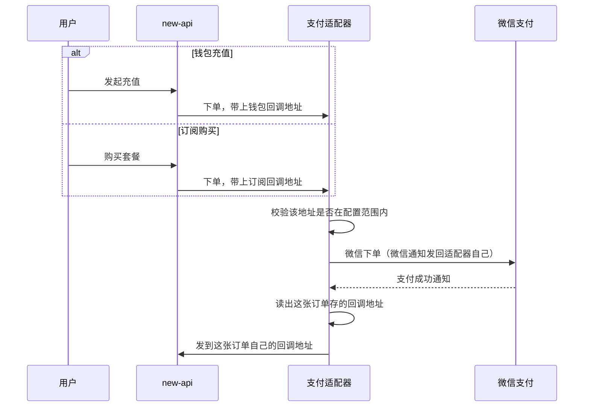

# 微信支付适配器多业务回调详细设计文档

## 0. 设计评审摘要（必读，约 2 页）

> 本节供 **产品 / 测试 / 研发** 快速评审方案；具体代码位置、配置项和实现细节见 **`## 1` 及之后**。
> 可测的需求条目见 `onespec/prd/wechat-epay-multi-notify/prd.md` 与 `specs/*.md`，本文件只讲怎么做。

### 0.1 一句话方案

只改独立的微信支付适配器：原来只能填一个回调地址，现在可以用逗号填多个；用户下单时地址必须和填进去的其中一个完全一样，通过后就把这个地址跟订单存在一起；支付成功后，就按这张订单存的地址回调，而不是所有订单都发往同一个地址。new-api 那边的两个回调接口一行都不用改。

### 0.2 做什么 / 不做什么（设计边界）

- **改的地方**：适配器读配置、下单时的地址校验、订单表里已有的回调地址字段、支付成功后发回调的后台任务、部署示例文件
- **不改的地方**：new-api 的代码、不把钱包和订阅的回调接口合成一个、不动微信那边的下单和通知地址、不加表不加字段、改完配置仍需重启才生效

### 0.3 关键链路或架构决策

- new-api 还是按业务各自拼地址：钱包充值拼 `/api/user/epay/notify`，订阅购买拼 `/api/subscription/epay/notify`
- 校验方式是「整条地址一模一样才放行」，不是「同一个域名下随便什么路径都放行」——后者会把同域其他接口也暴露出去
- 支付成功后要发到哪，是**从订单记录里读**的，不是从任务数据里读；这样升级前已经付了钱、还没通知成功的订单不用做任何数据处理，照样能发对
- 老配置只填了一个地址也能正常启动：按逗号拆完只有一条，同样算合法，行为和改之前一样

### 0.4 风险、降级与回滚

- 少配了一条地址 → 那条业务在下单时就被拒绝，不会走到扣款
- 订单里存的地址后来被从配置里删了 → 后台任务记一次失败并按原有节奏重试，绝不会改发到另一条地址上去
- 回滚：把环境变量改回只填一个地址，重启适配器即可

### 0.5 测试与验收关注点

- 下单：钱包和订阅两条路径都能建单，并且订单里存的地址各是各的
- 发回调：后台任务实际请求的地址，等于这张订单存的地址
- 反向验证：故意把代码改回「永远发第一个配置地址」，订阅那条用例必须失败，否则说明测试没起作用
- 预发环境：两条地址都配上后真机扫码走通；只配一条时，另一条业务下单应当失败

---

## 1. 引言

### 1.1 背景

上一个变更（#45）做适配器时，把「回调给 new-api 的地址」当成了全局唯一的一个值（见 `onespec/changes/45-wechat-epay-adapter/design.md` §5.1、§8）。

而 new-api 后台的「回调地址」只填站点域名，具体路径是代码按业务拼的：钱包充值和订阅购买拼出来的路径不一样。两条业务共用同一个支付网关地址，所以适配器里只能填一条，另一条必然走不通。

### 1.2 目标

1. 配置能填多条地址，同时兼容只填一条的老写法。
2. 下单时，配置里列出的任意一条都能通过，并把这条地址跟订单一起存下来。
3. 支付成功后，按订单自己存的地址发回调，且这个地址仍要在配置范围内。

## 2. 系统架构

### 2.1 模块交互图



和 #45 相比只有两处不同：**下单时的地址校验**、**发回调时的目标地址**。微信那边的通知地址仍固定为 `WECHAT_NOTIFY_URL`，不受影响。

### 2.2 模块划分

| 模块 | 做什么 |
|------|--------|
| `internal/config` | 把 `NEW_API_NOTIFY_URL` 按逗号拆成多条，顺手去掉首尾空格和空项 |
| `internal/order.NotifyURLPolicy` | 把每条地址整理成统一写法、去掉重复，并判断某个地址是否在其中 |
| `internal/httpserver.SubmitHandler` | 下单时做上述判断，并把整理后的地址存进订单 |
| `internal/store` | 订单表原有的回调地址字段照用；新增一个「按订单号取回调地址」的查询 |
| `internal/delivery.Worker` | 发回调前先取出订单的地址，再确认它仍在配置范围内 |
| `internal/delivery` HTTP 客户端 | 用同一份配置范围限制实际请求的目标，替换原来「只准发往那一个地址」的写法 |

new-api 侧 `controller.RequestEpay`、`controller.SubscriptionRequestEpay`、`EpayNotify`、`SubscriptionEpayNotify` **完全不改**。

## 3. 接口设计

本变更不新增任何对外接口。已有接口的影响：

| 接口 | 方法 | 路径 | 本变更影响 |
|------|------|------|------------|
| 适配器下单 | POST | `/submit.php` | 请求里的回调地址必须是配置里列出的某一条 |
| 微信支付通知 | POST | `/api/v1/wechat/notify` | 无 |
| new-api 钱包回调 | POST/GET | `/api/user/epay/notify` | 无改动，仍只处理充值订单 |
| new-api 订阅回调 | POST/GET | `/api/subscription/epay/notify` | 无改动，仍只处理订阅订单 |

下单表单的字段和 #45 一样。唯一变化是回调地址的判断条件：从「必须等于配置的那一个值」变成「必须是配置里列出的某一条」。

## 4. 数据模型

不加表、不加字段、不需要数据迁移。继续用订单表 `payment_orders` 里已有的 `notify_url`（最长 2048 字符，非空）。

发回调任务里存的那份数据副本（`NotificationPayload`）**不加**回调地址字段。发送时的取值顺序是：

```
后台任务取到一条待发送记录
  → 按订单号查出 notify_url
  → 确认它仍在配置范围内
  → 发往这个地址
```

这样做的好处是：升级前已经付款成功、还没通知到 new-api 的订单，只要当初下单时存的地址是对的，升级后就能自动发对，不用改历史数据。

判断「是否重复下单」用的那串摘要里仍然包含回调地址，且用的是整理后的写法——和跳转地址一直以来的处理方式保持一致。

## 5. 核心业务逻辑

### 5.1 读配置

- 环境变量名不变，仍是 `NEW_API_NOTIFY_URL`。
- 读取时按逗号拆开，每条去掉首尾空格，空的直接丢弃。
- 启动校验：拆完不能为空，且每一条都必须是完整的 https 地址。
- 代码里这个字段从单个字符串改成了字符串数组（`NewAPINotifyURLs`）。

### 5.2 地址范围判断

`order.NewNotifyURLPolicy` 在启动时做三件事：

1. 把每条地址整理成统一写法：必须是 https、不能带用户名密码、端口只能是默认的 443、域名转小写、路径里的 `.` 和 `..` 展开算实。
2. 整理完如果有重复的，只留一条。
3. 一条都没有、或任意一条不合法，直接启动失败。

之后每次判断某个地址能不能用，都是**先按同样规则整理，再和配置里的逐条比对，完全相同才通过**，否则报错。

这里特意**不用**「路径开头匹配」那种宽松判断——那是跳转地址（`RETURN_URL_ALLOWLIST`）的规则。回调地址如果用开头匹配，同域名下的其他接口就都被放开了。

### 5.3 下单

1. 验签、金额、商户号、支付方式这些校验和 #45 完全一样。
2. 校验回调地址是否在配置范围内，不通过就返回错误页，且不建单。
3. 存进订单的地址、以及算重复下单摘要用的地址，都用整理后的写法。
4. 向微信下单时用的通知地址仍是 `WECHAT_NOTIFY_URL`，和 new-api 的回调地址是两回事，别混。

路由注册时会先把这份地址范围准备好；如果配置不合法，服务起不来，不会带着错配置对外提供下单。

### 5.4 发回调

创建后台发送任务的函数现在会返回错误（配置不合法时启动即失败），内部用的是和下单同一份地址范围。

默认的 HTTP 客户端也带上了这份范围限制：正式请求和跟随跳转时都会再确认一次目标地址，防止被跳转到别的地方去。

每次发送前的处理顺序：

1. 按订单号查回调地址；查不到就记一次失败，走原有重试
2. 确认这个地址仍在配置范围内；不在就记失败，**不改发到别的地址**
3. 实际请求用整理后的地址

重试间隔、任务占用时限、以及「对方返回的内容去掉空白后必须正好是 `success` 才算成功」这些判断，都和 #45 一样，没动。

### 5.5 支付完成后的页面跳转（这是配置注意事项，不是代码改动）

订阅购买付完后跳回的地址是 `/api/subscription/epay/return`，钱包充值跳回的是站点的 `/wallet`。

如果 `RETURN_URL_ALLOWLIST` 收窄成 `/console/` 这类具体路径，这两条跳转都会被拒。建议直接填到站点域名一级（例如 `https://你的域名/`）。本变更没有改跳转地址的校验逻辑。

## 6. 安全与性能

- **身份校验**：下单仍靠易支付的 MD5 签名；管理接口不变。
- **防止请求被引到别处**：发回调的目标必须是配置里列出的完整地址，不允许「同域名任意路径」。
- **拿不准就拒绝**：不在配置范围内的下单和回调发送，一律拒绝，不做兜底放行。
- **性能**：配置里通常就两三条地址，逐条比对的开销可以忽略。
- **事务**：微信支付确认、通知成功这两处的事务范围没有变化。

## 7. 配置设计

| 配置项 | 本变更 | 说明 |
|--------|--------|------|
| `NEW_API_NOTIFY_URL` | 取值写法扩展 | 可用逗号填多条完整 https 地址；示例里同时给出钱包和订阅两条 |
| `RETURN_URL_ALLOWLIST` | 仅文档强调 | 规则不变（域名 + 路径开头），但要能覆盖订阅的跳转路径 |
| 其余微信、易支付相关项 | 不变 | 见 #45 设计文档 §8 |

预发示例（域名换成实际的）：

```bash
NEW_API_NOTIFY_URL=https://token-api-test.allaimo.com/api/user/epay/notify,https://token-api-test.allaimo.com/api/subscription/epay/notify
RETURN_URL_ALLOWLIST=https://token-api-test.allaimo.com/
```

new-api 后台的「回调地址」仍然只填 `https://token-api-test.allaimo.com`，**不要**带路径。

配置只在启动时读取一次。改完地址需要重启适配器；正在跑的发送任务用的是进程启动时读到的那份配置。

## 8. 测试设计

适配器模块内的测试（已实现）：

| 用例 | 所在包 | 防的是什么问题 |
|------|--------|----------------|
| 配置填一条 / 两条 / 空 | `internal/config` | 逗号拆分和启动校验出错 |
| 地址判断通过与拒绝 | `internal/order` | 大小写、端口、非 https 被误放行 |
| 下单两条路径都能建单 | `internal/httpserver` | 订阅在下单环节又被拒 |
| 下单用未配置的路径被拒 | `internal/httpserver` | 校验被放宽成同域随便发 |
| 发回调用订单自己的地址 | `internal/delivery` | 又退回到「所有订单发同一个地址」 |
| 地址被移出配置后不发送 | `internal/delivery` | 改发到另一条业务上去 |
| 请求目标范围限制 | `internal/delivery` | 被跳转引到配置外的地址 |

模块独立验证命令：`cd wechat-epay-adapter && GOWORK=off go build ./...` 和 `go test ./...`。

## 9. 影响范围与回归

| 项 | 说明 |
|----|------|
| 代码 | 只有 `wechat-epay-adapter/`，new-api 根模块零改动 |
| 文档 | `wechat-epay-adapter/.env.example`、`.deploy/wechat-adapter/.env.example`、`.deploy/README.md` |
| 需要回归 | 微信扫码下单、收银台、验签、订单状态流转、人工重试；new-api 两条回调各自的到账结果 |
| 上线顺序 | 先把 `NEW_API_NOTIFY_URL` 补成两条，再重启适配器；new-api 不需要发版 |

## 10. 与变更 #45 文档的关系

#45 的 PRD 里「首期不把订阅购买纳入验收范围」，以及 #45 设计文档里「`NEW_API_NOTIFY_URL` 是精确的 `/api/user/epay/notify` 地址」这两条，已被本变更取代。#45 其余设计（金额精度、订单状态流转、微信验签、重复通知只到账一次）继续有效。
