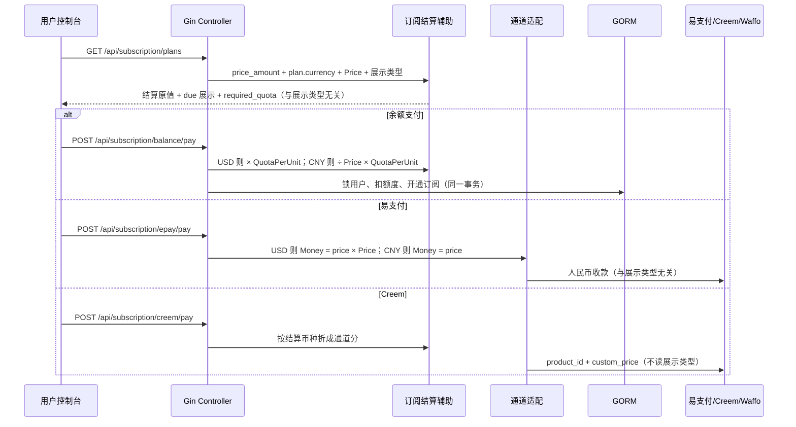
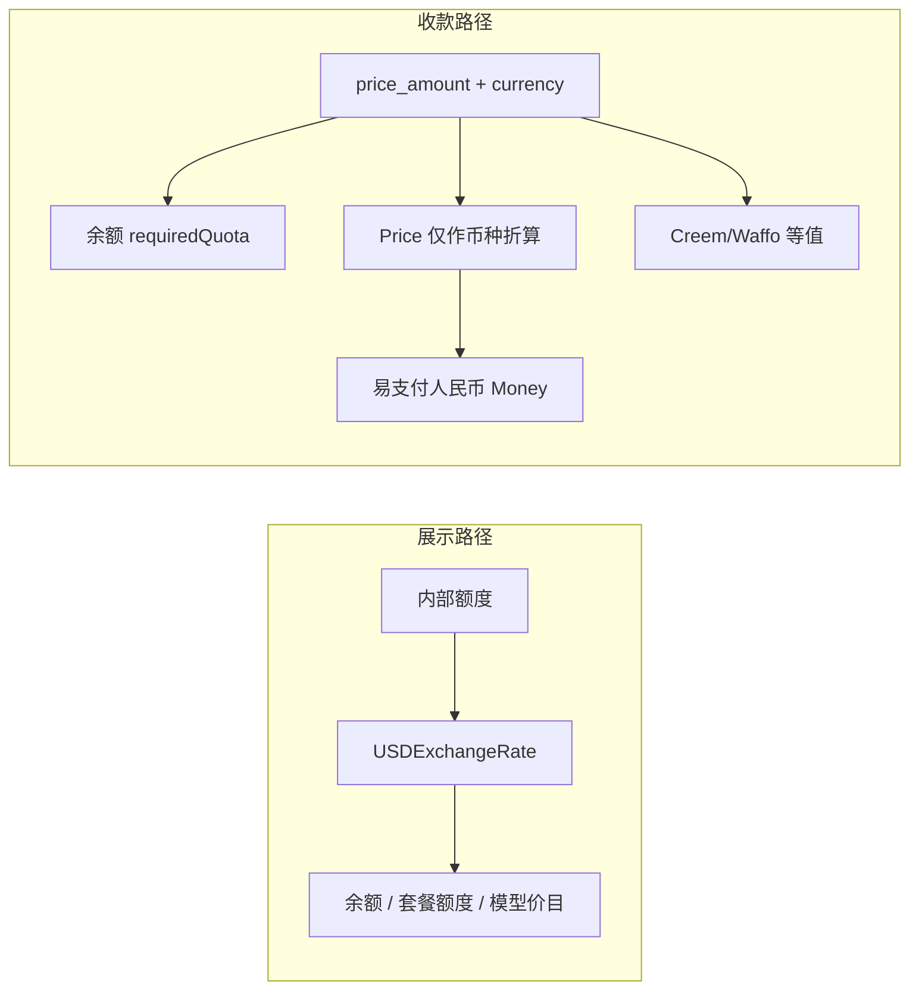

# 优化人民币汇率问题 详细设计文档

## 0. 设计评审摘要（必读，约 2 页）

> 本节供 **产品 / 测试 / 研发** 快速做技术方案评审；接口签名、表结构、时序与实现细节见 **`## 1` 及之后**。
> **不写 EARS**：可测需求见 `onespec/prd/cny-display-conversion/prd.md` 与 `specs/*.md`；本文件 §1+ 为 HOW。

### 0.1 一句话方案

套餐 **`price_amount` + `currency` 才是结算价**（空值默认 `USD`，与现网一致）。站点「额度展示类型」只换符号和换算，**不得改**收银台实收、也不得改余额扣减额度。国内收银台（易支付/微信）按结算价折成人民币收款。账本仍是内部额度，不改表。

### 0.2 做什么 / 不做什么（设计边界）

- **涉及**：套餐 `currency` 作为结算币种（管理端可配，**新建默认 USD**）；购买弹窗 / 套餐卡片 / 订阅管理价格列；余额扣减；易支付（含微信）订阅下单；充值到账与实付文案；展示汇率 vs 充值售价文案。
- **不做**：不改 **Creem**；**不改内置国内模型默认倍率跟随展示汇率**（另排）；不因切换展示类型改写 `price_amount` 或 `currency`；不改 `users.quota` 单位、不重算历史订单；不改套餐额度 `total_amount` 展示公式；不改微信支付验签与回调；Stripe 仍走 Price ID；不改游乐场。

### 0.3 关键链路或架构决策

- **结算读 `currency`，展示读 `quota_display_type`，两套互不改写。** 现网创建/更新把 `currency` 强制写成 `USD` 且支付不读该列，本轮改为：空则默认 USD；允许保存 `USD` / `CNY`；支付与余额按该列解释 `price_amount`。
- **不变式（产品确认）**：只切换额度展示（USD↔CNY），同一套餐的 **易支付实收、余额 `required_quota` 必须与切换前相同**。变的只是应付金额旁边的符号和换算数字。
- **两条数不要混**：`USDExchangeRate` 只管额度/价目怎么显示；`Price` 管「结算 USD ↔ 收银台人民币」以及 CNY 结算套餐折成内部额度。改展示汇率不改实付、不改余额扣减；改售价会改「USD 套餐的微信收款」和「CNY 套餐的余额折算」，仍不改展示类型本身。
- **余额公式**：`USD` 结算 → `requiredQuota = ceil(price_amount × QuotaPerUnit)`（与现网余额公式一致，故默认美元套餐切展示后余额扣减不变）；`CNY` 结算 → `requiredQuota = ceil(price_amount / Price × QuotaPerUnit)`。`Price <= 0` 且路径需要除售价 → 拒绝。
- **应付与余额需要**：跨币种展示一律用 `Price`（充值售价），**禁止**用 `USDExchangeRate`。
- **国内默认牌价跟随展示汇率**：本轮不做，`ratio_setting.USD2RMB` 保持现状。计价仍禁止用 `Price` 当模型汇率。

### 0.4 风险、降级与回滚

- **默认仍是 USD 的套餐**：微信将改为按 `price_amount × Price` 收人民币（不再把 20 当成 20 元）。若某套餐实际要收 ¥20，必须把该条 `currency` 改为 `CNY`，否则切到人民币展示后用户会看到约 ¥140 且微信也收约 140——这是结算价没改、只是以前易支付误把美元数字当人民币。
- **CNY 套餐的余额会比现网少扣**：现网不管 currency 都按美元额度扣；改成读 CNY 后才与微信 ¥20 同价。已售订单不回放。
- **脏数据**：名称「9.9 元」、价格存 `1.41` 的套餐修正符号后更显眼，不自动改库。
- **回滚**：回滚展示与折算相关提交即可；**不得**对已成功支付做冲正脚本。无特性开关，靠发布回滚。
- **失败策略**：售价无效、折算溢出 → **fail-closed**（拒绝下单/拒绝展示应付），禁止静默当 1 或截断乱扣。

### 0.5 测试与验收关注点

- **USD 套餐、价格 20、售价 7.3**：展示 USD 时应付 `$20`；切到 CNY 后应付约 `¥146`；两次微信收款相同、两次余额扣减相同；库内仍是 `20` + `USD`。
- **CNY 套餐、价格 20**：展示 CNY 时应付 `¥20` 且微信 `¥20`；切到 USD 后应付约 `$2.74` 并注明实扣 ¥20；微信与余额扣减仍与切之前相同。
- 只改展示汇率、不改售价与套餐：实付与余额扣减不变；余额数字/价目可变。
- 配置值：切展示类型后 `price_amount`、`currency` 均不变。
- 充值档：到账带展示货币符号，实付带收银台货币；人民币下输入框与档位大数字同单位；实付用 `Price` 不用展示汇率。
- 单测：USD/CNY 两套余额公式、售价非法、切展示 `required_quota` 不变。
- 手工：微信；Stripe 冒烟。Creem 不纳入本轮验收。国内默认牌价跟随不验收。

---

## 1. 引言

### 1.1 背景

禅道 Story 54「优化人民币汇率问题」。线上同一套餐出现 `$20` / `¥140` / `¥20` 三种口径：前端写死美元符号，余额把价格当系统美元额度，易支付按人民币原值收款，Creem 币种跟随额度展示类型。产品口径见 `onespec/prd/cny-display-conversion/prd.md`。

### 1.2 目标

- 用户可见应付金额与真实收款可对账。
- 余额支付与在线支付同价（无额外折扣配置时）。
- 展示设置变化不改变各通道收款。
- 管理员能区分展示汇率与充值售价。
- 新建套餐结算币种默认 USD；管理员可改为 CNY。

## 2. 系统架构

### 2.1 模块交互图





### 2.2 模块划分

- **Controller**：既有订阅/充值/选项入口；计划列表增加结算视图字段；选项保存时校验 `Price`、`USDExchangeRate`。不触发模型倍率刷新。
- **结算辅助（建议新包或 `model` 内导出函数，禁止散落复制公式）**：输入 `price_amount`、`currency`、`Price`、`QuotaPerUnit`、展示类型；输出结算、展示应付、`required_quota`、易支付人民币、通道等值分。`required_quota` 与通道金额不得读取展示类型。
- **Model/DAO**：创建/更新套餐停止无条件覆盖 `currency`（空默认 USD）；余额折算按结算币种分支；订单 `Money` 存与易支付同口径的人民币元。无新表。
- **Frontend**：`formatCurrencyFromUSD` 继续管额度；订阅应付改用结算视图或 `formatLocalCurrencyAmount`；充值档位拆「到账 / 实付」。
- **ratio_setting**：默认图中 `* RMB` 条目与汇率绑定刷新。
- **wechat-epay-adapter**：不在本变更修改。

## 3. 接口设计 (API Design)

> 本仓库为 Gin JSON：`{ "success", "message", "data" }` 或历史 `{ "message", "data" }`。订阅支付接口保持现有路径与鉴权（登录 + `CriticalRateLimit` + 支付合规）。

### 3.1 接口列表

| 接口名称 | 方法 | URL | 本变更 |
| :--- | :--- | :--- | :--- |
| 用户套餐列表 | GET | `/api/subscription/plans` | 响应增加结算视图字段 |
| 管理套餐列表 | GET | `/api/subscription/admin/plans` | 可选同样字段；价格列展示走前端 |
| 余额购买 | POST | `/api/subscription/balance/pay` | 扣减公式变更，请求体不变 |
| 易支付订阅 | POST | `/api/subscription/epay/pay` | 金额按结算币种折人民币，不跟展示 |
| Creem 订阅 | POST | `/api/subscription/creem/pay` | **本轮不改** |
| Stripe 订阅 | POST | `/api/subscription/stripe/pay` | **不改金额**（目录价） |
| 站点状态 | GET | `/api/status` | 已有 `price`、`usd_exchange_rate`、`quota_display_type`；前端充值继续用 |
| 充值下单 | 既有 topup 支付接口 | 请求 `amount` 仍为内部档位数量 | 展示层修改为主 |
| 保存选项 | 既有 PUT option | `Price`、`USDExchangeRate` | 增加正数校验；不刷新模型默认倍率 |

### 3.2 接口详情

#### GET `/api/subscription/plans`

- **功能描述**：返回已启用套餐；附加与扣费一致的应付展示数据，避免前后端各算一套。
- **鉴权**：登录用户。
- **请求参数**：无。
- **响应 `data[]` 在既有 `plan` 外增加（字段名建议）**：

```json
{
  "plan": { "id": 1, "price_amount": 20, "total_amount": 20.02, "currency": "USD" },
  "settlement": {
    "amount": 20,
    "currency": "USD"
  },
  "due_display": {
    "amount": 20,
    "currency": "USD",
    "note_settlement": null
  },
  "balance": {
    "required_quota": 10000000,
    "ok": true,
    "error": ""
  }
}
```

- **`due_display` 规则**（只影响展示，不改变 `balance.required_quota`）：
  - 展示类型与结算币种相同：应付 = `price_amount`，符号跟随结算币种。
  - 结算 `USD`、展示 `CNY`：应付 = `price_amount × Price`（与微信收款同一售价），可旁注结算 `$price_amount`。
  - 结算 `CNY`、展示 `USD`：应付 = `price_amount / Price`，旁注实扣人民币。
  - **禁止**用 `USDExchangeRate` 算应付；禁止未换算就把任意 `price_amount` 写死 `$`。
  - `TOKENS` / `CUSTOM`：应付旁注结算原币；token 展示可用 `required_quota`。
- **`balance.ok = false`**：售价非法、折算失败时仍返回套餐，但前端禁用购买并展示 `error`（可读中文/走 i18n）。
- **异常**：与现网一致；支付合规未确认时仍返回空列表。

#### POST `/api/subscription/balance/pay`

- **Request**：`{ "plan_id": int }`（不变）
- **成功**：`ApiSuccess`，事务内扣 `required_quota` 并创建已支付订阅订单。
- **业务错误**（HTTP 200 + 现网 `ApiErrorMsg` 风格，文案 i18n 后端中英）：套餐未启用、不允许余额、余额不足、售价未配置、额度单位非法、折算溢出。不足时额度不变、不创建成功订阅。

#### POST `/api/subscription/epay/pay`

- **Request**：`{ "plan_id": int, "payment_method": string }`（不变）
- **下单金额（人民币元，两位小数）**：结算 `CNY` → `price_amount`；结算 `USD` → `price_amount × Price`。**禁止**读 `quota_display_type`，**禁止**用 `USDExchangeRate` 代替 `Price`。
- **拒绝**：折算后 `< 0.01`、`Price` 非法且结算为 USD、支付方式不在 `PayMethods`、套餐未启用。支持的结算币种仅 `USD`、`CNY`（空视为 USD）。

#### POST `/api/subscription/creem/pay`

- **本轮不修改**（境外通道，保持现网）。

#### POST `/api/subscription/stripe/pay`

- **不纳入等值不变式**：金额由 `plan.stripe_price_id` 决定。设计约束：代码不得为「对齐展示类型」去改 Stripe 币种；运营在 Stripe 后台自行与 ¥20 对账。前端可保留 Stripe 按钮，文案不承诺与微信同额；Stripe 金额仍不随展示类型变化。

#### 选项 `Price` / `USDExchangeRate`

- **保存约束**：必须为有限正数（`> 0`）。拒绝 0、负数、NaN。两者允许不相等。
- **副作用**：无模型倍率刷新。`Price` 变更不得改模型倍率。

## 4. 数据模型 (Schema Design)

### 4.1 表结构

**无 DDL。** 不新增列，不改 `price_amount` decimal 精度，不改 quota 列类型。

| 已有字段 | 本轮语义 |
| :--- | :--- |
| `subscription_plans.price_amount` | 结算金额数字，**单位由 `currency` 决定** |
| `subscription_plans.currency` | **结算币种**：`USD`（空/缺省）或 `CNY`。展示类型不得改写本列。管理端创建/更新去掉「一律写成 USD」 |
| `subscription_orders.money` | 本笔易支付同口径的人民币元（USD 套餐为 `price × Price`） |
| `subscription_orders.provider_payload` | 余额单可继续 `charged_quota=` |
| `users.quota` | 内部额度，不变 |
| 选项 `Price` | 充值售价：买 1 系统美元额度应付的人民币；也用于 USD↔CNY 结算折算 |
| 选项 `USDExchangeRate` | 展示汇率：只格式化额度/价目，**不参与订阅实付与余额扣减** |
| `general_setting.quota_display_type` | 仅展示，不参与通道币种与 `required_quota` |

### 4.2 索引与事务

- 无新索引。
- **余额购买事务**（保持现网单事务）：`FOR UPDATE` 用户行 → 校验额度 → `quota - required` → 创建订阅 → 插入成功订单。失败全回滚。
- **在线支付**：先插 pending 订单再调第三方；拉起失败则过期/失败该单（现网模式）。回调入账逻辑不改。

## 5. 核心业务逻辑 (Business Logic)

### 5.1 订阅应付展示

- **输入**：`price_amount`、`currency`、`Price`、`quota_display_type`。
- **处理**：先定结算 `(S, C)`，再把结算折到当前展示币种（规则见 §3.2 `due_display`）。切换展示类型只改变这一步。
- **输出**：购买弹窗应付、套餐卡片价、订阅管理价格列（列上同时能看出结算币种，避免只看数字）。
- **异常**：需要 `Price` 做跨币种折算而售价非法 → 不渲染误导标价，禁用支付。
- **明确不动**：`total_amount` 仍走额度展示汇率；切展示不改库内价格与 `currency`。

### 5.2 余额与在线同价

- **输入**：`(S, C)`、`Price`、`QuotaPerUnit`、用户 `quota`。**不输入展示类型。**
- **处理**：
  - `C = USD`：`required = ceil(S × QuotaPerUnit)`（默认美元套餐与现网扣减一致，故切展示余额扣减不变）。
  - `C = CNY`：`required = ceil(S / Price × QuotaPerUnit)`。
  - `S <= 0`：`required = 0`。
- **输出**：扣减 `required`；前端「余额需要」与 **应付展示** 同币种同数字（都是结算价的展示形态），不是再把 `required` 用展示汇率乘一遍。
- **异常**：CNY 路径 `Price<=0` 或折算失败 → 拒绝；禁止 CNY 套餐回退到 `S × QuotaPerUnit`。
- **不变式**：同一套餐、同一售价下，展示 USD 或 CNY 时 `required` 相等，且与该次易支付人民币按售价折成的钱包购买力相等。

### 5.3 在线通道结算

**易支付（含微信适配器）**

- `C = CNY`：`Money = FormatFloat(S, 2)`。
- `C = USD`：`Money = FormatFloat(S × Price, 2)`。
- 展示类型变化不得改变 `Money`。

**Creem / Stripe**

- Creem **本轮不改**。Stripe 仍只传 `StripePriceId`，不随展示类型变化。

- 仍只传 `StripePriceId`；不随展示类型变化。

### 5.4 充值到账与实付

- **后端**：`getPayMoney` / `getTopUpQuota` 公式保持「`amount` × `Price` × 折扣」；`amount` 仍为内部数量（USD 展示单位下的档位值）。不把档位配置数组改写成乘汇率后的值。
- **前端**（`recharge-form-card` / `payment-confirm-dialog` / `calculatePresetPricing`）：
  - 到账：`formatCurrencyFromUSD(preset.value)`（或 tokens 规则），文案「到账」。
  - 实付：`formatLocalCurrencyAmount(actualPrice)`，文案「实付」，`actualPrice = preset.value * Price * discount`。
  - 去掉无单位的「7 / Pay 49」。
  - 人民币展示：自定义输入绑定 **展示单位**（`value * usdExchangeRate`），提交前 **除回** 内部 `amount` 再调既有计算器；禁止选中档位后输入框仍显示内部 7。
  - 自定义金额交互（对照原型方案 A）：不用原生 `number` spinner；输入框接近满宽并加 `$`/`¥` 前缀；右侧两个约 40×40 的 −/+；应付金额作为输入框下方辅助文案。步进每次 ±1 内部单位；已达最低充值额时 − 置灰。不改 `getPayMoney`。
- **异常**：`Price` 非法 → 不展示实付数字、阻断支付。
- **汇率 ≠ 售价**：允许到账 70、实付 73 这类差异。

### 5.5 管理端语义

- **文案**（i18n 全语言）：`USDExchangeRate` 标签改为展示汇率类（示例：1 系统美元额度显示为多少人民币）；`Price` 改为充值售价（示例：用户买 1 系统美元额度实付多少人民币）。禁止两处都叫「汇率」。支付设置里现有 `Price (local currency / USD)` 一并替换。
- **校验**：两字段 `> 0`；允许不相等。
- **余额/价目**：继续 `USDExchangeRate` + `formatCurrencyFromUSD` / `formatBillingCurrencyFromUSD`；**禁止**用 `Price` 格式化模型价目。
- **默认国内牌价跟随展示汇率**：本轮不做。

## 6. 安全与性能

- **鉴权**：订阅支付与余额扣减保持登录 + 支付合规；管理选项保持管理员。
- **金额安全**：所有额度换算走 `common.QuotaFromDecimalStrict` / 项目额度辅助，禁止 `int(float64)`。溢出拒绝本次操作并 `SysError`/`LogWarn`。
- **并发**：余额路径保持 `lockForUpdate` 用户行。
- **性能**：计划列表对每条套餐做常数次 decimal 运算。
- **日志**：禁止打印完整支付密钥；Creem/Waffo 失败记录 `trade_no`、plan_id、错误原因。
- **i18n**：新增控制台文案走 `t('English key')` 并补齐 locale（实现阶段用仓库 i18n skill）。
- **独立模块**：不修改 `wechat-epay-adapter`；无需 `GOWORK=off` 该模块验证，除非误改。

## 7. 影响范围与回归

**影响**：钱包订阅购买、订阅管理、添加资金展示、支付/计费设置文案、易支付订阅收款、余额账本扣减（CNY 套餐）。

**回归建议**：

- 单测：`calcSubscriptionBalanceQuota`（及结算辅助）、售价非法、切展示扣减不变。
- 接口：余额支付成功/不足；epay `Money`；合规关闭。
- 手工：USD 套餐切展示后微信金额与余额扣减不变；CNY 套餐微信 ¥ 原值且切展示扣减不变；管理端可改套餐结算币种。
- Stripe / 兑换码 / 适配器回调：冒烟即可。

## 8. 假设与待运营事项

- 套餐结算币种以 `subscription_plans.currency` 为准，默认 USD。展示类型不是结算币种。
- 若线上「VIP成长组」微信已在收 ¥20，而库内 `currency` 仍是 USD，上线后微信会改为按售价收约 ¥140。要保持收 20 元，须在后台把该套餐改为 `CNY`，**不会**自动改库。
- Creem 为境外通道，本变更不修改其下单逻辑。
- 内置国内模型默认牌价跟随展示汇率另排，不在本设计实现。
- 产品拍板见 `onespec/prd/cny-display-conversion/customer-confirm-round2.md`（2026-09-07 按建议同意）。
