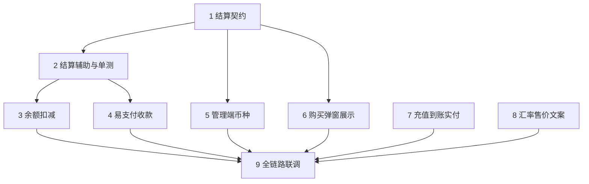

# 实施计划：优化人民币汇率问题（54-cny-display-conversion）

## 任务说明

- ✅ 已存在任务：禅道标题已存在则去重回填 ID
- 🆕 新创建任务：本次新建
- `(P)`：可与同阶段其他任务并行

需求追溯统一为禅道 Story **54**。产品拍板见 `onespec/prd/cny-display-conversion/customer-confirm-round2.md`。本轮不做 Creem、不做国内默认牌价跟随展示汇率。

## 任务列表

## 契约与模型定义

- [x] 1. 定义订阅结算辅助与套餐列表响应契约
  - 需求：54
  - 禅道任务ID：349
  - 参考：design.md § 3.1、§ 3.2、§ 4.1、§ 5.1、§ 5.2
  - 预计工时：3小时
  - **接口/协议变更**：
    - `GET /api/subscription/plans`（及管理端列表可选）在既有 `plan` 外增加 `settlement`、`due_display`、`balance` 字段协议：`settlement.amount/currency`；`due_display.amount/currency/note_settlement`；`balance.required_quota/ok/error`
    - 结算币种仅 `USD` | `CNY`，空视为 `USD`
    - `due_display` 只用于展示，不得改变 `required_quota`；跨币种用 `Price` 不用 `USDExchangeRate`
    - USD：`requiredQuota = ceil(price × QuotaPerUnit)`；CNY：`requiredQuota = ceil(price / Price × QuotaPerUnit)`
    - 易支付人民币：CNY 用原值，USD 用 `price × Price`
  - **后端代码变更**：
    - 新增结算辅助的类型与函数签名（建议 `model` 导出或独立小包），禁止在各支付文件复制公式
  - 验收标准：契约文档或测试表覆盖 USD/CNY × 展示 USD/CNY 四种组合的应付数字与 `required_quota` 不变式
  - 测试覆盖率：≥80%（核心功能）

## 核心业务功能

- [x] 2. 实现结算辅助与单元测试
  - 需求：54
  - 禅道任务ID：351
  - 参考：design.md § 2.2、§ 5.1、§ 5.2、§ 6
  - 预计工时：4小时
  - 依赖：任务 1
  - **后端代码变更**：
    - 实现结算辅助：输入 `price_amount`、`currency`、`Price`、`QuotaPerUnit`、展示类型；输出结算、展示应付、`required_quota`、易支付人民币金额
    - 额度换算走 `common.QuotaFromDecimalStrict`；`Price<=0` 且需要除售价时 fail-closed
    - `required_quota` 与易支付金额不得读取 `quota_display_type`
  - 验收标准：表测覆盖 USD 20 / Price 7.3、CNY 20、售价非法、切展示 `required_quota` 不变
  - 测试覆盖率：≥80%（核心功能）

- [x] 3. 余额购买按结算币种扣减
  - 需求：54
  - 禅道任务ID：350
  - 参考：design.md § 3.2 POST `/api/subscription/balance/pay`、§ 5.2、§ 4.2
  - 预计工时：3小时
  - 依赖：任务 2
  - **后端代码变更**：
    - `model/subscription.go`：`calcSubscriptionBalanceQuota` / `PurchaseSubscriptionWithBalance` 改为调用结算辅助
    - 保持单事务与 `lockForUpdate`；不足则提示余额不足、不扣部分额度
    - 订单 `Money` 存与易支付同口径人民币元；`provider_payload` 可继续 `charged_quota=`
  - 验收标准：USD 套餐扣减与现网公式一致；CNY 套餐按售价折算；切展示扣减不变
  - 测试覆盖率：≥80%（核心功能）

- [x] 4. 易支付订阅按结算币种收款
  - 需求：54
  - 禅道任务ID：352
  - 参考：design.md § 3.2 POST `/api/subscription/epay/pay`、§ 5.3
  - 预计工时：3小时
  - 依赖：任务 2
  - **后端代码变更**：
    - `controller/subscription_payment_epay.go`：CNY 用 `price_amount` 两位小数；USD 用 `price × Price`；禁止读展示类型与 `USDExchangeRate`
    - 折算后 `< 0.01` 或 USD 且售价非法则拒绝下单
    - **不改** `wechat-epay-adapter`、Creem、Stripe
  - 验收标准：CNY 套餐微信收原值；USD 套餐收价格×售价；仅切展示收款不变
  - 测试覆盖率：≥80%（核心功能）

- [x] 5. 管理端套餐结算币种可编辑
  - 需求：54
  - 禅道任务ID：353
  - 参考：design.md § 4.1、§ 1.2、customer-confirm-round2 第 3/4 项
  - 预计工时：3小时
  - 依赖：任务 1
  - **后端代码变更**：
    - `controller/subscription.go` 创建/更新去掉「一律写成 USD」；空默认 USD；仅允许 USD/CNY
  - **前端代码变更**：
    - `web/src/features/subscriptions/` 套餐表单增加结算币种选择；价格说明改为「数字单位由结算币种决定」
    - i18n 补齐 `web/src/i18n/locales/*.json`
  - 验收标准：新建默认 USD；可改为 CNY 并保存；切站点展示不改库内 `price_amount`/`currency`
  - 测试覆盖率：≥70%（一般功能）

- [x] 6. 购买弹窗与套餐价格列按结算视图展示
  - 需求：54
  - 禅道任务ID：354
  - 参考：design.md § 3.2 `due_display`、§ 5.1
  - 预计工时：4小时
  - 依赖：任务 1（联调依赖任务 2 的列表接口）
  - **接口/协议变更**：
    - 消费 `GET /api/subscription/plans` 的 `due_display` 与 `balance`；禁止前端用 `price_amount × quotaPerUnit` 再乘展示汇率算「余额需要」
  - **前端代码变更**：
    - `subscription-purchase-dialog.tsx`、`subscription-plans-card.tsx`、`subscriptions-columns.tsx`：去掉写死 `$`；应付与余额需要跟 `due_display`；套餐额度仍走既有额度展示
    - 跨币种展示旁注结算原币；`balance.ok=false` 禁用购买并提示
    - i18n 全语言
  - 验收标准：USD 套餐人民币展示应付=价格×售价；CNY 套餐人民币展示应付=原值；额度数字不随本任务改写
  - 测试覆盖率：≥70%（一般功能）

- [x] 7. 添加资金页到账与实付分列 (P)
  - 需求：54
  - 禅道任务ID：355
  - 参考：design.md § 5.4
  - 预计工时：4小时
  - **前端代码变更**：
    - `web/src/features/wallet/components/recharge-form-card.tsx`、`payment-confirm-dialog.tsx`、`lib/format.ts`：档位标明到账（展示货币）与实付（售价×折扣）；去掉无单位 Pay
    - 人民币展示下自定义输入与档位到账同一单位，提交前除回内部 `amount`
  - **后端代码变更**：
    - 不改 `getPayMoney` / `getTopUpQuota` 公式；档位配置列表不改写
  - 验收标准：售价≠展示汇率时到账与实付可以不同；售价非法不得用错误单位展示实付
  - 测试覆盖率：≥70%（一般功能）

## 配置管理功能

- [x] 8. 管理端展示汇率与充值售价文案及正数校验 (P)
  - 需求：54
  - 禅道任务ID：356
  - 参考：design.md § 3.2 选项、§ 5.5
  - 预计工时：3小时
  - **前端代码变更**：
    - `web/src/features/system-settings/general/pricing-section.tsx`、`integrations/payment-settings-section.tsx`：标签与示例区分展示汇率与充值售价，禁止都叫「汇率」
    - i18n 全语言
  - **后端代码变更**：
    - `model/option.go`（或既有选项保存路径）：`Price`、`USDExchangeRate` 必须有限正数；两者允许不相等；不刷新模型默认倍率
  - 验收标准：只改展示汇率时订阅应付与微信收款不变；0/负数拒绝保存
  - 测试覆盖率：≥70%（一般功能）

## 集成联调与验收

- [ ] 9. 订阅与充值金额全链路联调
  - 需求：54
  - 禅道任务ID：357
  - 参考：design.md § 0.5、§ 7、§ 8
  - 预计工时：4小时
  - 依赖：任务 3、4、5、6、7、8
  - **后端代码变更**：必要时补回归测试，不扩范围
  - 验收标准：
    - USD 20 / 售价 7.3：切展示前后微信金额与余额扣减不变
    - CNY 20：微信 ¥20，余额与在线同价，切展示扣减不变
    - 上线后管理员把实收 20 元的套餐改为 CNY，仅影响新单
    - 充值档位到账/实付带单位；Stripe 冒烟；Creem 不验收
  - 测试覆盖率：≥80%（核心功能）

## 依赖关系

## 任务统计

- 总任务数：9
- 已完成数：8 / 待执行数：1
- 按模块：契约与模型定义 1；核心业务功能 6；配置管理 1；集成联调 1
- 预计总工时：31 小时（约 3.9 人天，按 8 小时=1 人天）
- 可并行任务数：任务 7、8 可与 3–6 并行；任务 3、4、5 在任务 2（及 1）完成后可并行

## 任务执行建议

### 第一阶段：基础能力（约 1 天）

1. 任务 1 结算契约
2. 任务 2 结算辅助与单测

### 第二阶段：核心功能（约 2 天）

1. 任务 3 余额扣减、任务 4 易支付收款、任务 5 管理端币种（可并行）
2. 任务 6 购买弹窗（可与后端后半并行）
3. 任务 7 充值页、任务 8 管理端文案（可并行）

### 第三阶段：联调（约 0.5 天）

1. 任务 9 全链路联调；发版当天将实收 20 元的套餐改为人民币结算

## 风险提示

⚠️ **关键依赖**：

- 上线窗口：库内仍为 USD 且微信现收 20 元的套餐，发版到管理员改成 CNY 之前新单会按「价格 × 售价」收款

⚠️ **技术风险**：

- 金额路径禁止裸转 `int`；售价非法须 fail-closed
- 前端禁止再用展示汇率格式化「余额需要」

⚠️ **需要补充信息**：

- [ ] 禅道同步使用执行 ID **56**（Story 54 的 `linked2execution` → `release_v1.0.1`）。若要建到其他迭代，请用 `/onespec-task 54 --execution=<id>` 重跑同步
