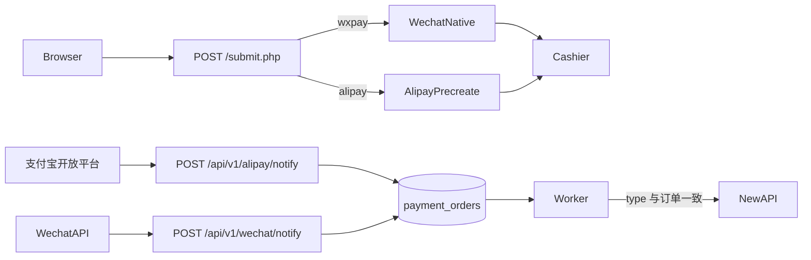
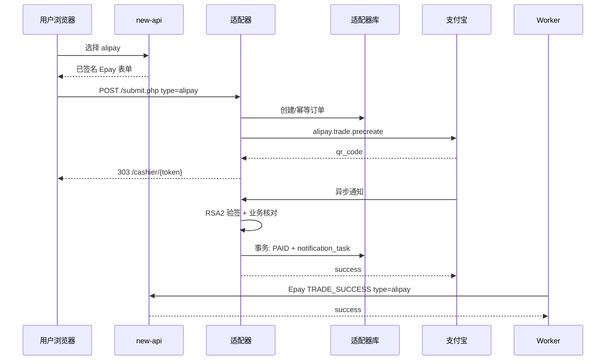

# 支付宝 Epay 适配器详细设计文档

## 0. 设计评审摘要（必读，约 2 页）

> 本节供产品、测试和研发快速评审；接口签名、表结构、时序与实现细节见 `## 1` 及之后。
> 可测需求以 PRD 与 `specs/*.md` 为准，本文件只描述实现方案。

### 0.1 一句话方案

在现有独立进程 `wechat-epay-adapter` 上增加支付宝当面付扫码：易支付 `type=alipay` 进单后走 `alipay.trade.precreate`，异步通知先验签再核对金额与身份，再按订单已保存的地址把 `type=alipay` 的易支付成功回调送给 new-api；微信支付原链路保持独立入口与独立密钥。

### 0.2 做什么 / 不做什么（设计边界）

- **涉及**：同一 Go module `wechat-epay-adapter`、同一数据库、同一 `POST /submit.php`、新增支付宝客户端与 `POST /api/v1/alipay/notify`、收银台按渠道换肤、订单表支付宝字段、通知 Worker 放行 `alipay`、就绪检查与指标按渠道拆分。
- **new-api**：不改源码。运营打开支付方式 `alipay`，`PayAddress` / `EpayId` / `EpayKey` 与微信共用；钱包与订阅仍用各自 notify 路径（适配器侧允许列表已存在）。
- **不做**：第二套适配器进程、电脑网站/H5/APP/JSAPI、自动退款、分账、改 new-api 入账公式、把同步跳转当成到账。

### 0.3 关键链路或架构决策

- 进单仍走 Epay MD5；`type` 允许 `wxpay` | `alipay`，其它值 403。指纹已含 `type`，同单改渠道视为冲突。
- 支付宝金额：本地继续存 `amount_fen` + `amount_text`；预下单与通知核对用两位小数元字符串，与 `amount_text` 规范化后全等，不用二进制浮点。
- 预下单接口 `alipay.trade.precreate`；`out_trade_no` 原样使用 new-api 商户订单号；`notify_url` 为适配器支付宝通知地址，不是 new-api 地址。
- 收银台按 `payment_type` 选择品牌与二维码字段：支付宝码不得写入微信 `wechat_code_url`。
- 支付宝通知与微信通知分 URL。支付宝为表单 POST，RSA2 验签（剔除 `sign`/`sign_type`），成功响应正文必须是 `success`。
- 只把 `TRADE_SUCCESS` / `TRADE_FINISHED` 视为已付；核对 `app_id`、`out_trade_no`、`total_amount`、可选 `seller_id`。
- 认领订单时要求本地 `payment_type=alipay`；微信通知不得更新支付宝行，反之亦然。
- 「标记已支付 + 创建 notification_tasks」仍在同一事务；Worker 按订单快照里的 `type` 回写，不再写死 `wxpay`。
- 支付宝密钥与微信 APIv3 材料分环境变量/文件注入。未配齐支付宝时拒支付宝新单，微信仍可下单；若显式开启支付宝渠道，就绪检查失败则不接新流量。

### 0.4 风险、降级与回滚

- **验签/错账**：fail-closed，进 `MANUAL_REVIEW`，不通知 new-api。
- **预下单超时**：不并发生成第二笔支付宝码；可查询后恢复或失败，策略对齐微信 `CREATE_UNKNOWN`。
- **支付宝不可用**：关 new-api 支付宝方式即可；微信入口继续。
- **回滚**：下线 `alipay` 支付方式；保留支付宝通知、补偿、只读查询，直到已付订单通知完成。

### 0.5 测试与验收关注点

- `alipay` 进单、`wxpay` 回归、未知 `type`、同单改类型冲突。
- `0.01` / `0.10` / `1.01` 与预下单、通知 `total_amount` 一致。
- 通知重放 10 次、金额不一致、app_id 错误、微信通知打到支付宝单。
- 钱包/订阅 notify 不串；Worker 对 `alipay` 不再因类型校验失败。
- 支付宝配置缺失时微信仍可进单；日志无私钥。
- `cd wechat-epay-adapter && GOWORK=off go test ./...` 与 `go build ./...`。
- 灰度 ≥20 笔真实小额支付宝，并抽检微信。

---

## 1. 引言

### 1.1 背景

变更 #45 已交付独立适配器：Epay 进单、微信 Native、异步通知、持久化回调、多通知地址（#46）。进单与 Worker 把支付类型钉死为 `wxpay`。new-api 已能配置 `alipay` 并幂等入账，但适配器会拒绝该类型。

### 1.2 目标

- 同一进程、同一库完成支付宝扫码闭环，不改 new-api 代码。
- 微信与支付宝渠道、密钥、通知入口、出码字段隔离。
- 模块保持独立 `go.mod`，禁止 import 根模块 `new-api`。

### 1.3 已核对契约

- new-api 易支付字段与 MD5 规则不变；回调识别 `type`、`trade_no`、`out_trade_no`、`money`、`trade_status=TRADE_SUCCESS`。
- 支付宝开放平台（文档中心当面付 / 异步通知）：预下单 `alipay.trade.precreate` 返回 `qr_code`；异步通知需 RSA2 验签；业务核对应包含 `out_trade_no`、`total_amount`、`app_id`，以及配置了则核对 `seller_id`；付款成功状态为 `TRADE_SUCCESS` 或 `TRADE_FINISHED`；商户应答字符串 `success` 后支付宝停止重试。
- 实现阶段锁定已验证的 Go SDK 版本（封装在 `internal/alipay`，对外只暴露本设计中的接口）。

## 2. 系统架构

### 2.1 模块划分

仍为独立目录 `wechat-epay-adapter/`。相对 #45 的增量：

| 模块 | 职责 |
| --- | --- |
| `httpserver` | `type` 分流；支付宝收银台模板；`POST /api/v1/alipay/notify` |
| `internal/alipay` | 预下单、同步响应验签、异步通知验签（对称 `internal/wechat`） |
| `order` | 支付宝 Native/扫码服务；二维码 URL 合法性（`https` 且主机受控，禁止 `weixin:` scheme） |
| `store` | 支付宝字段、`ConfirmAlipayPayment` 事务 |
| `delivery` | 允许 `alipay` 快照；`trade_no` 用支付宝交易号 |
| `config` / 就绪 | 支付宝材料；渠道开关 |



### 2.2 支付宝支付时序



## 3. 接口设计

### 3.1 接口列表

相对现网：**修改** `POST /submit.php` 的 `type` 枚举；**新增** 支付宝通知；收银台与管理查询增加渠道字段。微信通知路径不变。

| 接口 | 方法 | URL | 认证 | 变更 |
| --- | --- | --- | --- | --- |
| Epay 下单 | POST | `/submit.php` | Epay MD5 | `type` ∈ {`wxpay`,`alipay`} |
| 收银台 | GET | `/cashier/{access_token}` | 令牌 | 按 `payment_type` 渲染 |
| 收银台状态 | GET | `/api/v1/cashier/{access_token}/status` | 令牌 | 增加 `payment_type` |
| 微信通知 | POST | `/api/v1/wechat/notify` | 微信 APIv3 | 认领时校验本地类型为 `wxpay` |
| 支付宝通知 | POST | `/api/v1/alipay/notify` | 支付宝 RSA2 | **新增** |
| 就绪 | GET | `/health/ready` | 无 | 按已启用渠道检查密钥 |
| 管理查询 | GET | `/api/v1/admin/orders/{out_trade_no}` | Admin Bearer | 增加渠道与支付宝交易号 |
| 人工重试 | POST | `/api/v1/admin/orders/{out_trade_no}/retry-notification` | Admin Bearer | 无路径变更 |

### 3.2 `POST /submit.php`（增量）

字段表与 #45 相同，仅：

| 字段 | 约束变更 |
| --- | --- |
| `type` | `wxpay` 或 `alipay`；其它 → `403`，不落库 |
| `notify_url` | 仍须命中 #46 允许列表（钱包与订阅完整 URL） |

分流：

- `wxpay`：现有 `NativeOrderService` + 微信 `code_url`。
- `alipay`：`AlipayPrecreateService`；支付宝配置不完整 → `503` 或 `403`（实现选固定一种并在错误页说明「渠道未启用」），**不得**调用微信。
- 成功仍 `303` 到 `/cashier/{access_token}`。

冲突：`409` 当 `out_trade_no` 已存在且指纹不同（含 `type` 不同）。

### 3.3 收银台状态（增量）

现有 JSON 增加：

```json
{
  "payment_type": "alipay"
}
```

取值 `wxpay` | `alipay`。仍不返回二维码原文、密钥、支付宝/微信交易号。页面用该字段选择品牌色与提示文案。

### 3.4 `POST /api/v1/alipay/notify`

- **Content-Type**：`application/x-www-form-urlencoded`（支付宝异步通知惯例）。
- **验签**：官方规则，待签串剔除 `sign`、`sign_type`，参数 URLDecode 后字典序，RSA2 + 支付宝公钥（或证书模式对应验签）。`sign_type` 与配置不一致则拒绝。
- **业务核对**（全部通过才结算）：
  - `trade_status` ∈ {`TRADE_SUCCESS`, `TRADE_FINISHED`}
  - `out_trade_no` 存在且 `payment_type = alipay`
  - `app_id` = 配置 `ALIPAY_APP_ID`
  - `total_amount` 规范化两位小数后等于本地 `amount_text`
  - 若配置了 `ALIPAY_SELLER_ID`，则 `seller_id` 必须相等
  - `trade_no` 非空
- **应答**：业务接受（含幂等重复）时 HTTP 200，body 去除空白后为 `success`（支付宝重试条件）；验签失败可用 `fail` 或非 success 正文；数据库临时故障返回 `5xx` 以便重试。
- **未知订单**：审计后仍返回 `success`，避免毒重放打爆日志；不创建到账任务（与微信「未知单 200」同类，支付宝侧必须用 `success` 字符串）。
- **禁止**：把该入口的请求交给微信验签器。

### 3.5 new-api 回调（增量）

现有 Epay 成功字段不变。`type` 取订单 `payment_type`（`alipay` 或 `wxpay`）。`trade_no`：支付宝用 `alipay_trade_no`，微信仍用微信交易号。`money` 用 `amount_text`。Worker 删除「必须等于 `wxpay`」的硬编码，改为与配置 `pid` 一致且类型 ∈ 允许集合，并与库中订单类型一致。

成功判定不变：HTTP 2xx 且 body trim 后严格 `success`。

## 4. 数据模型

### 4.1 `payment_orders` 增量字段

三库兼容：SQLite 用 `ALTER TABLE ... ADD COLUMN`；可空列避免改已有微信行。

| 字段 | 类型 | 约束 | 说明 |
| --- | --- | --- | --- |
| `alipay_qr_code` | text | NULL | 预下单 `qr_code`，仅支付宝待支付使用 |
| `alipay_trade_no` | varchar(64) | NULL, UNIQUE | 支付宝 `trade_no` |
| `alipay_notify_id` | varchar(128) | NULL, UNIQUE | 通知 `notify_id`，辅助重放识别 |

已有 `payment_type` 继续使用，取值扩展为 `alipay`。`wechat_code_url` / `wechat_transaction_id` / `wechat_notification_id` 仅微信行填写。

**索引**：`alipay_trade_no`、`alipay_notify_id` 唯一（NULL 可重复，与现有微信交易号策略一致）。结算仍按 `out_trade_no` `FOR UPDATE`（`lockForUpdate`）。

### 4.2 其它表

`notification_tasks.payload_snapshot` 已含 `type`；无表结构变更，但写入支付宝成功单时 `type=alipay`、`trade_no=alipay_trade_no`。

审计 `event_type` 增加如 `ALIPAY_NOTICE_MISMATCH`、`ALIPAY_UNKNOWN_ORDER`、`CHANNEL_CROSS_NOTIFY`。

### 4.3 事务边界

`ConfirmAlipayPayment` 与 `ConfirmWechatPayment` 同构，独立函数避免串渠道字段：

同一事务内：`lockForUpdate` 按 `out_trade_no` → 渠道与核对 → 条件更新已支付字段 → `Create` 唯一 `order_id` 的 `notification_tasks`。提交前失败全回滚。

交叉通知：本地 `payment_type` 与通知渠道不一致 → `MANUAL_REVIEW` + `CHANNEL_CROSS_NOTIFY`，不更新对方渠道交易号。

## 5. 核心业务逻辑

### 5.1 进单分流

- **输入**：Epay 表单。
- **处理**：验签与金额、URL 策略与 #45/#46 相同；`type` 白名单；`alipay` 且材料不齐则拒绝；指纹含 `type`。
- **输出**：支付宝单调用预下单后 303；微信单保持原路径。
- **异常**：未知类型 403；冲突 409。

### 5.2 预下单

- **输入**：本地订单 `out_trade_no`、`subject`、`amount_text`、过期时间（默认 15 分钟，与现网微信策略对齐）。
- **请求要点**：`method=alipay.trade.precreate`；`biz_content` 含 `out_trade_no`、`total_amount`、`subject`、`timeout_express` 或 `time_expire`；公共参数 `app_id`、RSA2。
- **输出**：校验 `qr_code` 后写入 `alipay_qr_code`，状态 `PAYABLE`。
- **异常**：明确失败 → 创建失败；超时/未知 → `CREATE_UNKNOWN`，禁止并发换码。

### 5.3 收银台

- 支付宝：页头「ALIPAY」、主色 `#1677ff`，提示「请使用支付宝扫码」；QR 来自 `alipay_qr_code`。
- 微信：保持现网绿头与 `wechat_code_url`。
- 轮询只读本地状态。

### 5.4 支付宝结算

- **输入**：验签后的通知字段。
- **步骤**：锁订单 → 类型必须 `alipay` → 金额/app/seller/状态核对 → 已支付且 `alipay_trade_no` 相同则幂等成功 → 已支付但交易号不同则审查 → 非 `PAYABLE`/`CREATE_UNKNOWN` 则审查 → 条件更新 + 建任务。
- **金额**：禁止 `float64` 直接比；与 `ParseAmountFen` 同源规范化。
- **输出**：应答 `success` 或失败。

### 5.5 配置与就绪

建议环境变量（实现可微调键名，须写入部署文档）：

| 键 | 作用 |
| --- | --- |
| `ALIPAY_ENABLED` | `true` 时就绪检查要求下列材料齐全 |
| `ALIPAY_APP_ID` | 应用 ID |
| `ALIPAY_PRIVATE_KEY_FILE` | 应用私钥 PEM，只读挂载 |
| `ALIPAY_ALIPAY_PUBLIC_KEY_FILE` 或证书目录 | 验签材料 |
| `ALIPAY_NOTIFY_URL` | 公网 `https://…/api/v1/alipay/notify` |
| `ALIPAY_GATEWAY` | 正式/沙箱网关 |
| `ALIPAY_SELLER_ID` | 可选，通知核对 |
| `ALIPAY_SIGN_TYPE` | 默认 `RSA2` |

`ALIPAY_ENABLED=false` 或未配 `APP_ID`：支付宝进单拒绝；`/health/ready` 不依赖支付宝（微信现网可继续）。`ALIPAY_ENABLED=true` 且缺文件：ready=503。

微信现有变量不变。禁止用微信私钥调支付宝 API。

### 5.6 指标

现有计数器增加 label `channel=wxpay|alipay`（创建、支付成功、通知失败、审查、积压）。新增支付宝验签失败计数。

## 6. 安全与性能

- **鉴权**：支付宝通知只认 RSA2；管理接口仍 Admin Bearer。
- **SSRF**：notify/return 策略不因本变更放宽。
- **密钥**：私钥不入库、不进日志、不进镜像。
- **性能**：进单 P95 不含支付宝 RTT 仍 ≤300ms；通知处理不在事务内同步等待 new-api。
- **独立构建**：任何改动执行 `GOWORK=off go test ./...` 与 `go build ./...`（目录 `wechat-epay-adapter`）。
- **依赖**：新增支付宝 SDK 须在设计评审记录模块路径与版本；不得从根 module 引用。

## 7. 与 new-api 配置

运营侧：支付方式增加 `{ "name": "支付宝", "type": "alipay" }`；易支付地址仍指向适配器。无需改回调根域名语义。

## 8. 回滚

1. new-api 关闭 `alipay` 方式。
2. 适配器可设 `ALIPAY_ENABLED=false` 停止新单。
3. 保留 `/api/v1/alipay/notify` 与 Worker，直到已付支付宝单 `NOTIFY_SUCCESS`。
4. 不 DROP 支付宝列、不删已付订单。

---

**文档结束**
