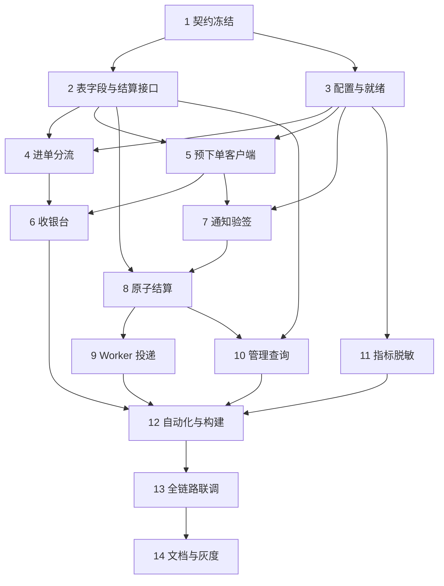

# 支付宝 Epay 适配器实施计划

## 任务说明

- ✅ 已存在任务：禅道中已存在并完成 ID 回填的任务。
- 🆕 新创建任务：同步禅道后新建并回填 ID 的任务。
- `(P)`：满足前置依赖后可与同阶段任务并行执行。
- 本计划在已上线的 `wechat-epay-adapter/` 上增量接入支付宝当面付扫码；**不修改** new-api 源码。运营仅配置支付方式 `alipay`。
- 需求追溯统一为禅道研发需求 **57**。禅道任务 ID 在同步后回填。
- 执行 ID 已确认为 `56`（`release_v1.0.1`）。禅道任务 ID 已回填。

## 契约与模型定义

- [x] 1. 冻结支付宝进单、预下单、通知应答与收银台增量契约
  - 需求：57
  - 禅道任务ID：361
  - 预计工时：3小时
  - **接口/协议变更**：
    - `wechat-epay-adapter/internal/httpserver/contract.go`：`type` ∈ {`wxpay`,`alipay`}；新增 `POST /api/v1/alipay/notify`；收银台状态增加 `payment_type`；支付宝成功应答正文为 `success`。
    - `wechat-epay-adapter/internal/alipay/`：定义预下单（`out_trade_no`、`total_amount`、`subject`、`qr_code`）与异步通知领域对象，隔离 SDK DTO。
    - `wechat-epay-adapter/internal/epay/`：增加 `PaymentTypeAlipay`；回调 `type` 取订单渠道。
  - **配置变更**：
    - `wechat-epay-adapter/.env.example`：列出 `ALIPAY_ENABLED` 及密钥/网关/通知 URL 键名，不写真实密钥。
  - 依赖：无。
  - 验收标准：与 design.md 路径、字段、fail-closed、未知单仍回 `success` 且不到账的策略一致；锁定 Go SDK 模块路径与版本。
  - 测试覆盖率：≥80%（核心协议契约）
  - 参考：design.md § 3.1-3.5、§ 1.3

- [x] 2. 扩展订单表支付宝字段与结算事务接口 (P)
  - 需求：57
  - 禅道任务ID：362
  - 预计工时：4小时
  - **后端代码变更**：
    - `wechat-epay-adapter/internal/store/store.go`：新增 `alipay_qr_code`、`alipay_trade_no`、`alipay_notify_id`；`ConfirmAlipayPayment` 事务签名（锁单、渠道校验、条件更新、唯一通知任务）。
    - `wechat-epay-adapter/internal/httpserver/wechat_notify.go` / store 微信确认：认领时要求 `payment_type=wxpay`，交叉通知进审查。
  - **SQL执行**：
    - `wechat-epay-adapter/migrations/`：三库可执行的 `ADD COLUMN` + 可空唯一索引；禁止破坏已有微信行。
  - 依赖：任务 1。
  - 验收标准：SQLite/MySQL/PostgreSQL 迁移可重复执行；NULL 唯一与微信交易号策略一致；交叉通知不写对方渠道字段。
  - 测试覆盖率：≥80%（核心数据与事务接口）
  - 参考：design.md § 4.1-4.3、§ 5.4

## 配置管理

- [x] 3. 接入支付宝配置、渠道开关与就绪检查
  - 需求：57
  - 禅道任务ID：363
  - 预计工时：3小时
  - **配置变更**：
    - `wechat-epay-adapter/internal/config/`：解析 `ALIPAY_*`；私钥只读文件；`ALIPAY_ENABLED=true` 时缺材料则进程不可就绪。
  - **后端代码变更**：
    - `wechat-epay-adapter/internal/httpserver/`：`/health/ready` 按已启用渠道检查；未启用支付宝时微信仍可就绪。
    - `wechat-epay-adapter/cmd/server/main.go`：装配支付宝客户端（仅在启用时）。
  - 依赖：任务 1。
  - 验收标准：未启用支付宝时微信进单不受影响；启用但缺密钥时 ready=503；微信密钥不得用于支付宝。
  - 测试覆盖率：≥70%（配置与就绪）
  - 参考：design.md § 5.5、§ 6

## 核心业务功能

- [x] 4. 实现易支付类型分流与支付宝进单拒绝策略
  - 需求：57
  - 禅道任务ID：364
  - 预计工时：4小时
  - **后端代码变更**：
    - `wechat-epay-adapter/internal/httpserver/submit.go`：`alipay`/`wxpay` 分流；未知类型 403；支付宝未启用不调微信。
    - `wechat-epay-adapter/internal/epay/contract.go`：允许类型常量。
  - 依赖：任务 2、3。
  - 验收标准：合法 `alipay` 可建单；`wxpay` 回归；未知类型不落库；同单改 `type` 返回 409。
  - 测试覆盖率：≥80%（核心进单）
  - 参考：design.md § 3.2、§ 5.1

- [x] 5. 封装支付宝预下单与不确定结果恢复 (P)
  - 需求：57
  - 禅道任务ID：365
  - 预计工时：4小时
  - **后端代码变更**：
    - `wechat-epay-adapter/internal/alipay/`：RSA2 调用 `alipay.trade.precreate`，校验 `qr_code`。
    - `wechat-epay-adapter/internal/order/`：写入 `alipay_qr_code`；失败/超时对齐 `CREATE_FAILED`/`CREATE_UNKNOWN`；禁止并发换码。
  - 依赖：任务 1、2、3；可与任务 4 在接口冻结后并行，集成前完成。
  - 验收标准：仅有效 `qr_code` 进入 `PAYABLE`；`0.01/0.10/1.01` 的 `total_amount` 与 `amount_text` 一致；scheme 不得为 `weixin:`。
  - 测试覆盖率：≥80%（核心预下单）
  - 参考：design.md § 5.2、§ 3.2

- [x] 6. 按渠道渲染收银台并返回 payment_type
  - 需求：57
  - 禅道任务ID：366
  - 预计工时：3小时
  - **接口/协议变更**：
    - `wechat-epay-adapter/internal/httpserver/cashier.go`：状态 JSON 增加 `payment_type`；支付宝蓝头与文案；微信保持现网。
  - 依赖：任务 4、5。
  - 验收标准：支付宝页不展示微信码；微信页不展示支付宝码；不返回交易号与密钥。
  - 测试覆盖率：≥80%（核心展示与状态）
  - 参考：design.md § 3.3、§ 5.3

- [x] 7. 实现支付宝异步通知验签
  - 需求：57
  - 禅道任务ID：367
  - 预计工时：4小时
  - **接口/协议变更**：
    - `wechat-epay-adapter/internal/httpserver/`：`POST /api/v1/alipay/notify` 表单解析；验签失败非 `success`；库故障 5xx。
  - **后端代码变更**：
    - `wechat-epay-adapter/internal/alipay/`：剔除 `sign`/`sign_type` 后 RSA2 验签。
  - 依赖：任务 3、5。
  - 验收标准：错误公钥/篡改字段不结算；不把报文交给微信验签器。
  - 测试覆盖率：≥80%（核心验签）
  - 参考：design.md § 3.4

- [x] 8. 实现支付宝原子结算与渠道交叉拒绝
  - 需求：57
  - 禅道任务ID：368
  - 预计工时：4小时
  - **后端代码变更**：
    - `wechat-epay-adapter/internal/store/`：`ConfirmAlipayPayment`；`TRADE_SUCCESS`/`TRADE_FINISHED`；金额规范化比对；幂等与交易号冲突审查。
  - 依赖：任务 2、7。
  - 验收标准：同一成功通知 10 次仅一次有效支付与一个通知任务；交叉通知审查且不到账。
  - 测试覆盖率：≥80%（核心事务与幂等）
  - 参考：design.md § 4.3、§ 5.4

- [x] 9. 按订单类型投递易支付回调
  - 需求：57
  - 禅道任务ID：369
  - 预计工时：3小时
  - **后端代码变更**：
    - `wechat-epay-adapter/internal/delivery/worker.go`：允许 `alipay`；`type`/`trade_no` 与订单一致。
  - 依赖：任务 8。
  - 验收标准：支付宝回调 `type=alipay`；钱包/订阅地址不串；trim 后 `success` 才停重试。
  - 测试覆盖率：≥80%（核心投递）
  - 参考：design.md § 3.5

## 性能优化与安全

- [x] 10. 管理查询展示渠道并加固微信认领 (P)
  - 需求：57
  - 禅道任务ID：370
  - 预计工时：2小时
  - **后端代码变更**：
    - `wechat-epay-adapter/internal/admin/`：查询返回 `payment_type` 与脱敏支付宝交易号。
    - 微信 `ConfirmWechatPayment`：本地类型必须 `wxpay`。
  - 依赖：任务 2、8。
  - 验收标准：未授权仍 401/403；人工重试复用原任务。
  - 测试覆盖率：≥80%（核心管理边界）
  - 参考：design.md § 3.1、§ 4.3

- [x] 11. 按渠道拆分指标并保证日志脱敏 (P)
  - 需求：57
  - 禅道任务ID：371
  - 预计工时：3小时
  - **后端代码变更**：
    - `wechat-epay-adapter/internal/observability/`：计数器 `channel` 标签；支付宝验签失败计数。
  - 依赖：任务 3；最终接入 4–9。
  - 验收标准：标签无订单号/URL/密钥；私钥不出现在日志。
  - 测试覆盖率：≥70%（可观测性）
  - 参考：design.md § 5.6、§ 6

## 集成联调与验收

- [x] 12. 完成适配器自动化回归与独立模块构建
  - 需求：57
  - 禅道任务ID：372
  - 预计工时：6小时
  - **后端代码变更**：
    - `wechat-epay-adapter/**/*_test.go`：进单分流、金额、预下单 mock、通知重放、交叉渠道、Worker 类型、配置缺失。
  - 依赖：任务 4–11。
  - 验收标准：`GOWORK=off go test ./...` 与 `go build ./...` 通过；不导入 new-api 根模块。
  - 测试覆盖率：核心功能 ≥80%
  - 参考：design.md § 0.5、§ 6

- [ ] 13. 完成支付宝、微信回归与 new-api 全链路联调
  - 需求：57
  - 禅道任务ID：373
  - 预计工时：6小时
  - **配置变更**：
    - 沙箱/小额：`ALIPAY_NOTIFY_URL` 公网 HTTPS；new-api 打开 `alipay`；保留 `wxpay`。
  - 依赖：任务 12；需要支付宝应用当面付、密钥与联调环境。
  - 验收标准：钱包与订阅各至少一笔支付宝到账且回调不串；微信回归；停机重试与错金额审查符合设计。
  - 测试覆盖率：以联调清单全通过为准
  - 参考：design.md § 2.2、§ 7、§ 8

## 文档与发布

- [ ] 14. 更新部署说明并执行灰度验收
  - 需求：57
  - 禅道任务ID：374
  - 预计工时：4小时
  - **配置变更**：
    - `wechat-epay-adapter/` 部署文档与 `.env.example`：支付宝密钥挂载、回滚关 `alipay` / `ALIPAY_ENABLED`。
  - 依赖：任务 13。
  - 验收标准：≥20 笔真实小额支付宝四方一致；抽检微信无回归；回滚后已付单仍可补偿。
  - 测试覆盖率：以灰度对账记录为准
  - 参考：design.md § 7、§ 8

## 依赖关系

## 任务统计

| 项目 | 数量/工时 |
| --- | --- |
| 总任务数 | 14 |
| 已完成 / 待执行 | 12 / 2 |
| 契约与模型定义 | 2 |
| 配置管理 | 1 |
| 核心业务功能 | 6 |
| 性能优化与安全 | 2 |
| 集成联调与验收 | 2 |
| 文档与发布 | 1 |
| 预计总工时 | 53 小时，约 6.6 人天 |
| 可并行任务数 | 4（任务 2 相对 3 启动后；5 与 4；10/11 与部分核心） |

## 任务执行建议

### 第一阶段：契约与数据（约 1.3 人天）

1. 任务 1 冻结协议与 SDK。
2. 任务 2、3 并行推进表结构与配置就绪。

### 第二阶段：主链路（约 3.5 人天）

1. 任务 4、5 并行后接入任务 6。
2. 任务 7、8、9 串起通知到账。
3. 任务 10、11 可与结算后期并行。

### 第三阶段：质量与发布（约 2.0 人天）

1. 任务 12 独立模块回归。
2. 任务 13 联调（含微信回归）。
3. 任务 14 灰度与回滚演练。

## 风险提示

⚠️ **关键依赖**：

- 支付宝开放平台当面付、应用绑定、RSA2 公钥或证书模式、公网 `ALIPAY_NOTIFY_URL`。
- 现网微信适配器与 #46 通知允许列表保持可用。
- new-api 不改代码，依赖运营配置 `alipay`。

⚠️ **技术风险**：

- Worker 仍拒绝非 `wxpay` 会导致「已付却通知失败」；必须与结算同一迭代交付任务 9。
- 支付宝应答必须是正文 `success`，不能照搬微信 `204`。
- 金额字符串规范化错误会造成审查或错账。
- 新增 SDK 不得破坏 `wechat-epay-adapter` 独立 `go.mod`。

⚠️ **需要补充信息**：

- [x] 同步禅道时确认执行 ID（`56`）。
- [ ] 生产/沙箱网关、`ALIPAY_SELLER_ID` 是否必核对。
- [ ] 灰度账号、单笔上限、人工退款 SOP。
