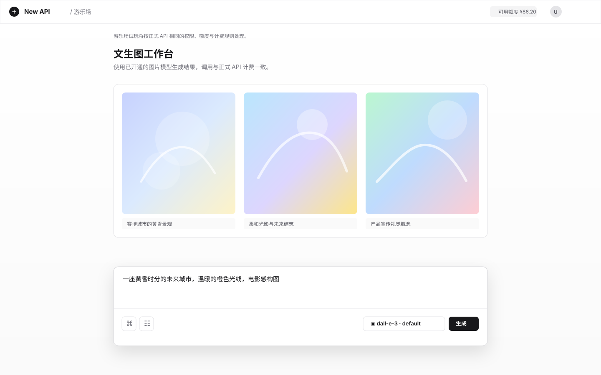

# 游乐场多媒体试玩需求文档

## 0. 评审摘要（必读，约 2 页）

> 本节供产品、研发、测试、管理员快速评审；详细条款见 `## 1` 及之后。
> 客户沟通稿见同目录 `customer-confirm.md` 与 `prototype-before-after.html`。正文默认采用确认表中的建议选项；若客户改口，应回写本节与 §9。

### 0.1 一句话需求

登录用户在现有游乐场中选择模型后，能直接试对话、文生图、文生视频；结果在同一页展示，计费与正式 API 一致。

### 0.2 做什么 / 不做什么

- **做什么**：按模型能力切换对话 / 绘图 / 视频工作台；绘图同步出图；视频提交后展示进度并在完成后可播放；沿用登录会话，不要求用户填写 API Key；额度按该用户可用分组的正式转发规则预扣与结算。
- **不做什么**：不新开独立绘图或视频站点；不做图生视频；不做聊天内上传参考图；不做 Kling / 即梦官方专用入口；不修改对外公开 API 合同。

### 0.3 关键流程或生效方式

1. 用户进入现有「游乐场」，选择分组与模型。
2. 系统按模型已发布能力进入对应工作台；用户不能在错误工作台提交。
3. 对话保持现有流式体验；绘图提交提示词及相关参数后当场展示图片；视频提交后进入进行中，完成后可播放。
4. 额度不足、无权限或上游失败时给出可读原因，不静默丢输入。

### 0.4 原型预览（评审基线）

> 原型用于确认页面结构和关键交互，不代表最终视觉稿；正式实现应沿用现有 Playground 的主题、输入区、模型选择器与权限/计费链路。

- **交互原型**：[在浏览器中打开](./playground-multimodal-preview.html)
- **评审关注点**：模型切换后自动进入对话 / 文生图 / 文生视频工作台；图片同步展示结果；视频任务展示处理中至可播放状态；试玩额度与正式 API 一致。

### 0.5 验收怎么测

- 选中绘图模型时，界面不出现对话专用参数，提交不出聊天失败。
- 选中对话模型时，不能按绘图参数提交。
- 一次合法文生图请求能出图，并产生与正式 API 一致的扣费记录。
- 一次合法文生视频请求能进入进行中并在成功后可播放。
- 管理员关闭的模型不可选。

---

## 1. 文档信息

### 1.1 基本信息

| 项目 | 内容 |
|------|------|
| 文档标题 | 游乐场多媒体试玩需求文档 |
| 文档版本 | V1.0 |
| 编写日期 | 2026-09-02 |
| 来源需求 | 客户诉求：游乐场补充图片模型、视频模型调用 |
| 需求等级 | A 级：跨控制台与转发能力，涉及真实计费 |
| 审核状态 | 待客户确认表签字后视为产品冻结 |

### 1.2 变更历史

| 版本 | 日期 | 变更内容 | 影响范围 |
|------|------|----------|----------|
| V1.0 | 2026-09-02 | 首版，对齐客户对照原型 | 游乐场、模型列表展示、试玩计费提示 |

### 1.3 术语表

| 术语 | 定义 |
|------|------|
| 游乐场 | 控制台内登录用户试用模型的页面，不依赖用户自备 API Key |
| 工作台 | 对话、绘图、视频三种试玩界面之一 |
| 模型能力 | 站点已发布模型所支持的调用类型，如对话、文生图、文生视频 |
| 正式 API | 用户使用令牌调用的对外接口，本需求的计费应对齐该路径 |

## 2. 项目概述

### 2.1 项目背景

游乐场目前只提供对话试玩。图片与视频模型会出现在模型名单中，但提交仍按对话处理，用户无法在控制台验证效果与扣费。渠道侧已具备文生图与异步视频能力，缺口在试玩入口与交互。

### 2.2 业务目标

- 用户无需离开控制台即可验证已开通的绘图、视频模型是否可用。
- 试玩消耗与正式调用使用同一套额度与权限，避免「试玩免费、API 收费」两套口径。
- 管理员无需为试玩单独维护白名单。

### 2.3 项目范围

**范围内**：现有游乐场页面；文生图；文生视频；模型按能力分组展示；失败与进行中状态；多语言文案。

**范围外**：图生视频、Vision 贴图、Kling/即梦官方页、独立菜单、公开 API 变更。

### 2.4 待业务确认项

以 `customer-confirm.md` 为准。默认：试玩扣费；首期仅文生图与文生视频；视频等待可接受。

## 3. 角色与权限

| 角色 | 职责 |
|------|------|
| 登录用户 | 在游乐场选择分组与模型并提交试玩 |
| 平台管理员 | 配置渠道与模型启停；不另配试玩名单 |
| 系统 | 按模型能力切换工作台并执行与正式 API 一致的计费 |

无权用户、被关闭模型、不可用分组下，用户应无法完成对应试玩。

## 4. 功能需求

### 4.1 工作台切换

#### PG-001：按模型能力进入工作台

**优先级**：P0

**需求描述**：用户选择模型后，游乐场进入对话、绘图或视频工作台之一。

**业务规则**：

1. 能力以站点已发布模型信息为准。
2. 同一模型声明多种能力时，主工作台优先级为视频高于绘图高于对话。
3. 用户不能在当前工作台提交另一种能力的请求。

**验收标准**：

1. 当用户选中仅具备绘图能力的模型时，系统应展示绘图工作台且隐藏对话专用参数。
2. 当用户在绘图工作台点击提交时，系统应按文生图处理，不应按对话处理。
3. 当用户选中仅具备对话能力的模型时，系统应保持对话工作台，不应展示绘图张数或视频时长。

### 4.2 绘图试玩

#### PG-002：文生图

**优先级**：P0

**需求描述**：用户输入提示词，可选张数、尺寸、质量（能力具备时展示），提交后同步展示图片。

**业务规则**：

1. 张数不得超过平台已对正式文生图生效的上限。
2. 结果以图片展示。
3. 计费与该用户用同一分组调用正式文生图一致。

**验收标准**：

1. 当提示词合法且额度充足时，系统应展示生成图片。
2. 当张数超过平台上限时，系统应拒绝提交并说明原因。
3. 当额度不足时，系统应拒绝生成并提示额度不足。

### 4.3 视频试玩

#### PG-003：文生视频

**优先级**：P0

**需求描述**：用户输入提示词，可选时长、尺寸（能力具备时展示），提交后进入进行中，成功后可播放。

**业务规则**：

1. 时长不得超过平台已对正式视频任务生效的上限。
2. 等待过程应可见，失败应可读。
3. 计费与正式视频任务一致。

**验收标准**：

1. 当任务仍在处理时，系统应展示进行中状态而不是当成对话失败。
2. 当任务成功时，用户应能在页面播放结果。
3. 当任务失败时，系统应保留提示词并展示失败原因。

### 4.4 对话保持

#### PG-004：对话工作台不回退

**优先级**：P0

**需求描述**：对话模型继续使用现有流式对话、现有参数及网页搜索能力。

**验收标准**：

1. 当用户使用对话模型时，现有流式对话应仍可用。
2. 当用户改选绘图或视频模型时，系统应隐藏对话专用参数。

### 4.5 计费提示

#### PG-005：试玩即计费

**优先级**：P0

**需求描述**：空态或提交前应提示试玩与 API 计费相同。

**验收标准**：

1. 当用户进入游乐场时，系统应展示试玩将消耗额度的说明。

## 5. 非功能需求

1. 控制台已支持的语言均应提供对应文案。
2. 试玩不得绕过正式路径已有的数量与时长上限。
3. 失败不得清空用户未提交以外的有效输入。

## 6. 验收用例表

| 编号 | 场景 | 期望 |
|------|------|------|
| U1 | 选 dall-e 类绘图模型发「画一只猫」 | 出图，有扣费 |
| U2 | 选 gpt 对话模型 | 仍为聊天，无张数 |
| U3 | 选视频模型提交 | 进行中 → 可播放或失败原因 |
| U4 | 额度不足 | 拒绝且说明 |
| U5 | 管理员关闭该模型 | 列表不可选或提交被拒 |

## 7. 管理员配置与风险

- 只需保证渠道已接入对应模型。
- 试玩消耗真实额度，需在页面提示，避免客诉「控制台试用免费」。
- 高风险：金额扣费、图片张数、视频时长。

## 8. 开放问题

以客户确认表为准。无额外开放项。
